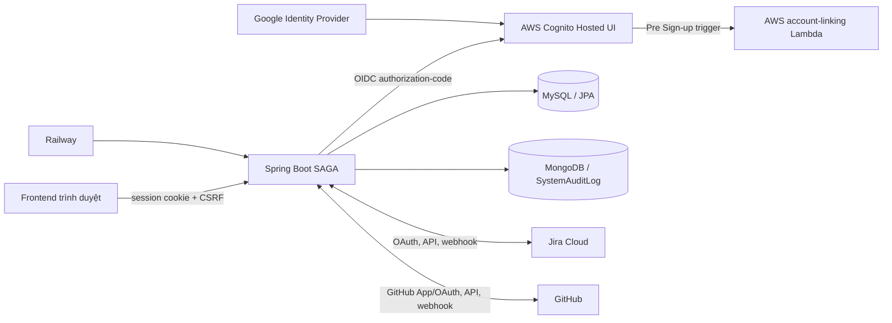
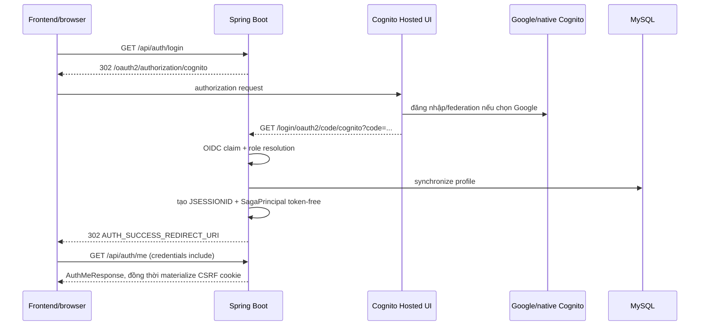

## Merged main authority sync — Project / Lecturer / Admin / AI — 2026-08-15

- **CONFIRMED:** `main` đã chứa Project V1, Lecturer Dashboard, AI Agent Backend và Admin Dashboard V1. Generated OpenAPI operation count = **149** (contract test PASS). Migration head = **V32** (`V30` AI delegation context, `V31` project type, `V32` project group weight config); không version collision (migration contract PASS).
- **CONFIRMED — Project V1:** `GET /api/project-types` authenticated (ADMIN/LECTURER/STUDENT), session `JSESSIONID`, GET không CSRF. `POST /api/project-types` ADMIN + CSRF; catalog động, không canonical production seed; DB mới có thể trả `[]`. `POST /api/teams/{teamId}/projects` bắt buộc `projectTypeId` (`PROJECT_TYPE_REQUIRED` khi thiếu); unknown type fail controlled; response/detail gồm ProjectType. `PUT /api/projects/{projectId}/group-weights` lưu exact Project+Team Code/Document/Design (tổng 1.0); ADMIN hoặc LECTURER instructor của Course. Contribution đọc Project+Team override trước, fallback Course slice weights; **formula/Peer Review/Rubric không đổi**. Live HTTP Contribution = `TeamContributionService`; `ContributionCalculationService` không phải HTTP authority hiện hành.
- **CONFIRMED — Lecturer Dashboard:** thêm `GET /api/v1/courses/{courseId}/dashboard/teams-progress|contribution-summary|trends|at-risk-summary` (ADMIN/LECTURER). Các analytics hiện hữu khác vẫn trên `LecturerAnalyticsController` (detail, overview, progress, activities, contribution-detail, early-warnings, student interactions, burndown, heatmap, velocity). Early warning deterministic `OVERDUE_TASK` only. **Không** có GHOSTING / TOXIC_COMMUNICATION / TECHNICAL_DEBT / AI-derived warning trong source hiện hành.
- **CONFIRMED — Admin Dashboard V1:** `GET /api/admin/reports/anomalies` và `GET /api/admin/reports/graph-processing`; ADMIN only; GET không CSRF; không Bearer. Anomalies: `OVERDUE_TASK` SUPPORTED + real count; `MSR`/`DEADLINE_PROCESS`/`SNA_ISOLATION` = TBD + `count=null` (không dùng 0). Graph-processing: `periodDays=7`, `historySupported=false`, `points=[]`; không fake history.
- **CONFIRMED — AI public gateway:** bảy route `/api/v1/ai/**` trong OpenAPI (conversations CRUD/list/send, pending confirm/reject, artifact download). `/internal/ai/**` `@Hidden`, không phải FE contract. Trust: Browser→Backend session/CSRF; Backend↔AI service tokens; AI không đọc SAGA business DB, không gọi Jira/GitHub, không là business authority.
- **PARTIAL / TBD:** deployed Swagger runtime currency (do not claim deployed Swagger is current). Default/prod config: springdoc API docs and Swagger UI default **off** unless explicitly enabled via env (`SWAGGER_ENABLED` / `SPRINGDOC_*` — no secret values documented here). HF/AI product smoke; commit-review production worker topology.
- **FULL_SUITE:** clean run **994 tests / 23 failures / 0 errors** — 22 CSRF context-order isolation flakes (grouped reruns green) + 1 DEC-023 Course roster baseline. `FULL_SUITE_GREEN = NO`. Không chứng minh stable feature regression mới sau OpenAPI/migration reconciliation.

## J1K.1 TaskType.REQUEST physical schema correction — 2026-08-13

- **CONFIRMED_RUNTIME_SCHEMA_MISMATCH:** Jira search HTTP 200 fetched issues, but canonical upsert failed at `UPSERT_ISSUES` with MySQL 1265 `Data truncated for column 'type'`. Read-only `information_schema` evidence showed `task.type` as `enum('BUG','EPIC','FEATURE','STORY','SUBTASK','TASK')`, nullable `YES`, default `NULL`; Java already had `REQUEST`.
- **ROOT CAUSE:** `TASK_TYPE_DATABASE_ENUM_MISSING_REQUEST`. The J1K claim that schema was unchanged is superseded: a first-class persisted `TaskType.REQUEST` requires the physical MySQL enum to include `REQUEST`.
- **FIX:** V29 changes only `task.type` to the exact current TaskType set and preserves `NULL DEFAULT NULL`, existing rows, indexes and foreign keys. Flyway is the only deployment authority; no production ad-hoc ALTER.
- **REGRESSION:** migration/schema contract compares SQL enum values to every Java `TaskType`; persistence round-trips every value; Jira Request canonical upsert and reconciliation Request batch are covered. Deployment smoke remains TBD until V29 is applied normally.
- **TEST EVIDENCE:** targeted regression is 114/114 PASS. Full clean is 880 tests with only the 4 pre-existing non-J1K failures (OpenAPI count, Course roster, two Lecturer Analytics); J1K.1 and migration contracts have zero failures/errors.

## J1K Jira external Web Task sync correctness — 2026-08-13

- **CONFIRMED_SOURCE_TEST:** dynamic webhook đăng ký đúng các event `jira:issue_created`, `jira:issue_updated`, `jira:issue_deleted`, `comment_created`, `comment_updated`, `comment_deleted`, `sprint_created`, `sprint_updated`, `sprint_deleted`, `sprint_started`, `sprint_closed`. Jira ingress vẫn authenticate JWT/board secret, persist encrypted deduplicated receipt rồi mới xử lý async; không tin raw payload để canonical upsert create/update.
- `jira:issue_created` và `jira:issue_updated` tiếp tục trigger shared canonical reconciliation. Scheduler/manual reconciliation là fallback cùng pipeline, không phải bằng chứng webhook production đã giao thành công.
- Generic Jira sync nay discovery estimation field từ board configuration, thêm đúng field ID đó vào `fields` của enhanced search cùng Sprint field discovery và parse whole non-negative string/number (`0`, `0.0`, `5`, `5.0`). Không hardcode `customfield_*`. Field explicit null là authoritative replace và clear local; field bị provider omit thì không clear.
- `jira:issue_deleted` sau verification/dedup/board resolution đọc tối thiểu `issue.id` hoặc fallback `issue.key`, lookup chỉ trong Project sở hữu JiraBoard rồi đặt `Task.deletedAt` UTC theo DEC-035. Unknown/repeated delete là controlled no-op; không hard-delete/cascade. Generic upsert không clear `deletedAt`, nên stale snapshot đã fetch trước delete không thể resurrect tombstone.
- Diagnostics chỉ ghi receipt/board/event/result, sync stage/count/category; không raw payload, issue key/title, token, secret hay credential. Admin integration health local-only nay trả latest safe webhook receipt summary và latest persisted Jira webhook-maintenance result; maintenance success/failure cũng xuất hiện trong sync history bằng `jobType=OTHER`, stage `WEBHOOK_MAINTENANCE`. Không provider-live call. Targeted Jira/webhook/admin regression pass **13 suites / 184 tests / 0 failures / 0 errors / 0 skipped**. Full clean chạy **134 suites / 848 tests / 2 failures / 0 errors / 0 skipped**: baseline Course roster/DEC-023 đã biết và một notification ordering failure ngoài scope; notification suite rerun riêng pass **8/8**. **TBD_DEPLOYMENT_SMOKE:** webhook delivery và Jira Web create/update/Story Point/delete thật sau deploy.

## J1J Jira Task provider-ID ownership / Update Priority business resolution — 2026-08-10

- **CONFIRMED_SOURCE/TEST:** normal `PUT /api/v1/projects/{projectId}/tasks/{taskId}` nhận `priority` theo enum SAGA `LOW|MEDIUM|HIGH|CRITICAL`. Backend đọc `editmeta` của đúng issue, yêu cầu field editable, rồi dùng chung resolver J1C với Create: dedup provider ID, ưu tiên đúng một canonical exact-name, chỉ dùng semantic fallback khi còn đúng một ID; zero/multiple distinct candidate fail closed bằng `JIRA_PRIORITY_RESOLUTION_NOT_FOUND`/`JIRA_PRIORITY_RESOLUTION_AMBIGUOUS` trước Jira PUT.
- **BACKWARD COMPATIBILITY:** `priorityId` vẫn là Jira provider ID override nâng cao và phải thuộc `priority.allowedValues`; stale trả `400 JIRA_PRIORITY_INVALID`. Gửi đồng thời `priority` và `priorityId` cũng trả `400 JIRA_PRIORITY_INVALID` trước claim/provider call. Payload provider vẫn là `{"fields":{"priority":{"id":"<resolved-provider-id>"}}}`; canonical GET/upsert/fresh confirmation và remote-success recovery J1G giữ nguyên.
- **IDEMPOTENCY:** Task Update fingerprint chứa riêng business `priority` và explicit `priorityId`; cùng raw intent tạo cùng fingerprint, priority khác hoặc business-vs-explicit không bị coi là cùng request. Không persist provider payload/metadata và không đổi schema.
- **PROVIDER-ID AUDIT:** Create `issueTypeId`/`priorityId` là override nâng cao; Assignee dùng SAGA Student UUID rồi resolve `IdentityMap ACTIVE`; Sprint dùng SAGA Sprint UUID rồi resolve external ID; Estimation chỉ nhận integer và discovery field; Delete dùng SAGA Task UUID. Transition ID vẫn là provider ID nhưng được backend trả theo từng issue qua GET transitions để FE round-trip. `componentIds` của Create/Update vẫn là Jira component IDs và chưa có public options endpoint được chứng minh: đây là gap chỉ ghi nhận, không sửa trong J1J.
- **HISTORICAL BEFORE J1K / SUPERSEDED BY THE J1K ISSUE-TYPE SECTION BELOW:** main Update did not have `type`; J1K now implements business `TaskType` resolution from exact-issue editmeta. Runtime remains **TBD_DEPLOYMENT_SMOKE**.

## J1I Jira Estimation canonical decimal normalization — 2026-08-10

- **CONFIRMED_SOURCE:** `estimateIssue` nhận HTTP 2xx bằng bodiless response, không parse PUT body. `JIRA_RESPONSE_INVALID` của incident phát sinh sau `markRemoteSucceeded`, tại canonical `GET /rest/api/3/issue` khi Story Point discovery field bị parser cũ từ chối vì không phải JSON integer.
- **Đã hoàn thành:** canonical Story Point nhận JSON string hoặc number biểu diễn integer không âm, gồm `"0"`, `"0.0"`, `"5"`, `"5.0"`; chuẩn hoá bằng `BigDecimal` và `intValueExact`, không so sánh `double`. Phân số, âm, blank, non-numeric, missing/null, object/array hoặc ngoài `Integer` fail-safe `JIRA_RESPONSE_INVALID`.
- **Không đổi:** public request vẫn integer không âm; PUT body không phải canonical truth. HTTP 200 đã xác nhận remote success, sau đó chỉ GET/upsert/fresh confirmation đúng target mới complete; lỗi canonical giữ `REMOTE_SUCCEEDED`, retry cùng key không PUT lại.

## J1H Jira Task Estimation remote-success finalization — 2026-08-10

- **CONFIRMED_SOURCE/FIX:** `TASK_ESTIMATION` đồng bộ remote id/key/status vào object orchestration ngay sau `markRemoteSucceeded` commit riêng, trước canonical reconciliation. Flow discovery estimation field theo board, Jira GET có field đã discover, upsert và `JiraCanonicalTaskReadService` fresh `REQUIRES_NEW` read-only; chỉ `complete` khi `storyPoint` canonical đúng `request.value`.
- **CONFIRMED:** canonical fetch/upsert/read hoặc target mismatch sau remote success giữ `REMOTE_SUCCEEDED`, không `FAILED` và không gọi lại Jira estimation mutation. Retry cùng `Idempotency-Key` và request fingerprint chỉ canonical recover; response `COMPLETED` replay dùng snapshot local hiện có.
- **BOUNDARY:** operation chỉ persist fingerprint hash, không persist target estimation giải mã được. Vì vậy background recovery không hoàn tất `TASK_ESTIMATION`; nó giữ `REMOTE_SUCCEEDED` để retry cùng request/key xác nhận target. Không đổi global DB isolation, entity/schema/migration, provider ID/customfield hardcode, bearer auth, session/CSRF hoặc authorization.

## J1G Jira Task update edit-metadata correctness — 2026-08-10

- Historical J1G baseline: `PUT /api/v1/projects/{projectId}/tasks/{taskId}` accepted `title`, `description`, `priority`, `priorityId`, `dueDate`, `labels`, `componentIds`. J1K supersedes only the type gap by adding business `type`; assignee/Sprint/estimation/status remain separate.
- Backend dùng `GET /rest/api/3/issue/{issueIdOrKey}/editmeta`; chỉ suppress field bằng canonical local khi an toàn (title, priority có metadata name, dueDate theo ngày, labels, component IDs). Description non-null vẫn requested vì ADF bị flatten.
- Metadata không cho field còn phải gửi: `400 JIRA_EDIT_FIELD_NOT_ALLOWED` và WARN an toàn không có value/secret. Provider PUT 400 vẫn là `JIRA_REQUEST_REJECTED`.

# SAGA — Context kỹ thuật hệ thống hiện tại

## A13 — Admin advanced gap closure, 2026-08-10

- **CONFIRMED:** capability Admin core A12 và shared-domain cross-access có evidence không cần namespace `/api/admin` mới: Course master data/roster, Team roster, Task/Sprint, analytics, Peer Review và Contribution đều có authorization riêng theo endpoint; ADMIN chỉ được phép ở các endpoint source đã nêu rõ.
- **BLOCKED:** per-user audit không hứa complete history vì `actorLocalProfileId`/`actorRole` chỉ forward-only và repository chỉ có global pageable read. Role mutation thiếu transition/profile/Cognito/session governance; password reset thiếu Cognito Admin contract; Course membership thiếu team-selection/retention; notification thiếu schema evidence/consumer; generic evaluation setting thiếu global typed contract.
- **RECOMMENDED:** product quyết định riêng cho từng blocker trước khi mở API. Không suy diễn ADMIN bypass toàn hệ thống, không duplicate `/api/admin/courses/**`, không thêm chart, Bearer, Cognito Admin API, migration hoặc Mongo backfill.

## A12 — Admin backend closure, 2026-08-09

**CONFIRMED:** Admin core gồm user list/status/import, CRUD master data, active Semester,
progress/export, global audit/stats/integration health và global team/project read.
Toàn bộ dùng browser session; unsafe mutation cần CSRF, không Bearer/Cognito Admin API.

**PARTIAL/BLOCKED:** A11A chỉ ghi durable local actor cho event audit mới. Per-user audit history,
notification broadcast, impersonation, role/password mutation, manual Course membership, Project
DELETE và generic settings không có contract/source endpoint; không được suy diễn là Admin core.

## Cập nhật 2026-08-09 — Account lifecycle M3B

**CONFIRMED:** `AccountStatus` áp dụng cho Student và Lecturer; Admin không có status. V21 thêm `lecturer.account_status NOT NULL DEFAULT 'ACTIVE'`, backfill row cũ và Lecturer mới/cũ null đều ACTIVE. `PATCH /api/admin/users/{id}/status` là ADMIN + CSRF, resolve localProfileId cùng Admin user union; chỉ Student/Lecturer, chỉ nhận ACTIVE/INACTIVE/SUSPENDED, PENDING bị provisioning Student sở hữu.

**CONFIRMED:** Business request trong browser session dùng current local DB status mỗi request: ACTIVE cho phép; Student PENDING/INACTIVE/SUSPENDED và Lecturer INACTIVE/SUSPENDED bị 403. `/api/auth/me`, `/api/auth/csrf`, `/api/auth/logout` được miễn; `/me` trả current DB status. Status mutation không cascade Course, membership, Project hay provider/history.

## Cập nhật 2026-08-09 — M9 Admin notification broadcast: BLOCKED sau audit

**CONFIRMED:** `Notification` hiện chỉ là JPA entity cô lập với `recipientId`,
`recipientRole`, `title`, `message`, `isRead` và các timestamp/id từ `BaseEntity`.
Không có `NotificationRepository`, `NotificationType`, service, controller, route HTTP,
producer, consumer, test, polling, WebSocket/SSE hay email delivery liên quan.

**BLOCKED:** Flyway repository không có V1 legacy và không có migration V2–V24 nào tạo
hoặc thay đổi `notification`; `ddl-auto=validate` không tạo schema. Vì vậy không thể
xác nhận physical table, FK recipient, nullable/index/unique hay giới hạn title/message
trong production. Ba profile `admin`, `lecturer`, `student` là bảng tách biệt; không có
common user table để FK chung, còn `recipientRole` là String không có enum/constraint.

**QUYẾT ĐỊNH:** Không tạo `POST /api/admin/notifications/broadcast`, không migration,
fanout, delivery, provider call hay reuse invitation outbox. Persist-only không có consumer
không phải capability hoàn chỉnh. Cần business contract riêng cho audience role, account
status, plain-text bounds, read lifecycle và retention; sau đó thiết kế versioned schema
riêng (khuyến nghị broadcast master + per-recipient receipt nếu cần read/unread từng user).

**M8B:** `GENERIC_SYSTEM_SETTINGS = TBD_NOT_IMPLEMENTED_NO_CONFIRMED_GLOBAL_SETTINGS`;
không dùng generic settings để thay thế notification domain.

## Cập nhật 2026-08-09 — M10 Support & Diagnostics

**CONFIRMED:** `GET /api/admin/integrations/health` là ADMIN-only local diagnostic.
Nó trả enabled flag, linked-project count, raw count theo `IntegrationStatus`, Jira
stored-webhook-id count, GitHub installation status count, latest persisted `lastSyncedAt`
và webhook-receipt status count. Endpoint không inject/gọi Jira/GitHub provider và không
trả token, credential mã hóa, secret, webhook ID, payload, URL hay Cognito subject. Đây
không phải provider-live health và không tự tạo score HEALTHY/UNHEALTHY.

**BLOCKED:** `GET /api/admin/users/{id}/audit-logs` chưa có. Mongo audit chỉ có
`actorId` string (Cognito subject) và `localProfileId` không đồng nhất trong payload của
một số producer; không có durable local-profile field hay matching rule cho mọi log.
Không query/viết lại historical record để ép mapping. Impersonation, role mutation,
password reset và manual Course add/remove cũng chưa có contract/session/governance riêng.

## Cập nhật 2026-08-09 — Audit AccountStatus M3A

**CONFIRMED:** Chỉ `Student` sở hữu `AccountStatus` (`ACTIVE`, `INACTIVE`, `SUSPENDED`, `PENDING`); Admin/Lecturer không có field này. Principal trong JSESSIONID mang snapshot status từ login; không có DB status check theo request, SessionRegistry hay thu hồi session khi status DB thay đổi. First-login imported Student chỉ PENDING -> ACTIVE; ACTIVE giữ nguyên; INACTIVE/SUSPENDED bị từ chối bind/activate.

**TBD / BLOCKED BY POLICY:** Source không chứng minh Admin được set status nào, self-target, hay policy enforce API. `PATCH /api/admin/users/{id}/status` chưa được tạo; không thêm schema Admin/Lecturer, Cognito call hay arbitrary transition.

## Cập nhật 2026-08-09 — Course Update và Soft Delete

**CONFIRMED:** Course có `deletedAt` qua V20. `PUT`/`DELETE /api/v1/courses/{id}` là ADMIN-only và CSRF-protected. Create/update chỉ resolve Subject, Class, Semester active; Course tombstone không xuất hiện ở detail/list/filter và không tái dùng courseCode. DELETE chỉ soft-delete Course chưa dùng; Team, Project, StudentCourseInvitation hoặc TaskWeightConfig còn tham chiếu thì 409. Không hard-delete, cascade, detach hay thay đổi membership/import delivery.

## Cập nhật 2026-08-09 — Semester Update và Soft Delete

**CONFIRMED:** Semester có `deletedAt` theo migration V19. `PUT`/`DELETE /api/v1/semesters/{id}` là ADMIN-only, cần browser session và CSRF. DELETE đặt tombstone, active detail/list/search không trả row đó; hard delete/cascade không tồn tại. `CourseRepository.existsBySemesterId` chặn `409` khi Course còn tham chiếu. Code tombstone vẫn chiếm uniqueness. Course service không đổi trong milestone này.

## Cập nhật 2026-08-09 — Admin Read Foundation

**CONFIRMED:** `GET /api/admin/users`, `/audit-logs`, `/system-stats`, `/teams` và `/projects` yêu cầu session `ROLE_ADMIN`. Chúng chỉ đọc snapshot MySQL/Mongo local, không mutation hay provider call. DTO không trả Cognito subject, token, provider/raw audit payload, IP, repository URL hoặc secret integration. Users union ba local profile table với phân trang/count tại DB; audit logs sort timestamp giảm dần.

## Update 2026-08-09 — Jira Task Create metadata ownership

### J1C — exact canonical name trước semantic fallback

- **CONFIRMED runtime:** sau J1 dedup provider ID, production vẫn ghi `ISSUE_TYPE_RESOLUTION`
  và `PRIORITY_RESOLUTION` AUTO `AMBIGUOUS`; đây là nhiều provider ID khác nhau cùng map về một
  business enum, không phải duplicate ID.
- **CONFIRMED:** resolver dedup provider ID trước; trong semantic candidates, đúng một name đã
  normalize trùng enum (`TASK`, `CRITICAL`, `LOW`, `MEDIUM`...) được ưu tiên. Không có exact thì
  chỉ một semantic ID mới được dùng; nhiều ID thật sự vẫn fail-closed 409 `*_AMBIGUOUS`.

- **CONFIRMED:** Backend sở hữu Jira create metadata theo từng Jira Project; FE normal gửi business `type` (`TaskType`) và `priority` (`Priority`), không nhập Jira numeric ID.
- **CONFIRMED:** `issueTypeId` và `priorityId` vẫn là optional advanced override tương thích ngược. Backend lấy issue-type metadata trước, validate explicit issue type thuộc Project rồi mới gọi create-fields; explicit priority phải thuộc `priority.allowedValues`.
- **CONFIRMED:** auto-resolution dùng đúng normalization đã có ở canonical Jira upsert. Zero hoặc nhiều candidate fail closed; không hardcode Jira ID, không cache metadata cross-project, không đổi write-operation/session/CSRF/authorization.
- **CONFIRMED:** task-create diagnostics chỉ ghi projectId, operation/stage/resource type, resolution mode/result, upstream status, error category và write-operation status; không ghi credential, raw response hay Idempotency-Key.
- **CONFIRMED runtime/source 2026-08-09:** DEMO-8 (`10009`) và DEMO-9 (`10010`) kết thúc với `JiraWriteOperation=COMPLETED`, `completed_at`, canonical Task local và `safe_error_code=NULL`. WARN cũ `JIRA_WRITE_RECOVERY_REQUIRED` được ghi sau `completed_at` vì flow cũ complete operation trước local confirmation; object dùng log có thể giữ status cũ `REMOTE_SUCCEEDED`.
- **CONFIRMED:** Task Create nay xác nhận canonical local Task trước `complete`. Canonical fetch/upsert/xác nhận thất bại giữ `REMOTE_SUCCEEDED` và trả recovery-required; retry cùng Idempotency-Key chỉ canonical recovery, không POST Jira lần hai. Không đổi metadata policy, scope, session/CSRF, authorization, entity, migration hay reconciliation.

## Update 2026-08-08 — Jira Sprint state trong list response

- **CONFIRMED:** `Sprint.state` đã tồn tại là `String` nullable trong canonical local read model và `JiraSprintResponse` đã trả nguyên representation này. `SprintSummaryResponse` nay trả thêm `state` từ trực tiếp `Sprint#getState()` cho cả `GET /api/v1/projects/{projectId}/sprints` và `GET /api/v1/teams/{teamId}/sprints`.
- **CONFIRMED:** list service chỉ đọc repository local, không inject/gọi Jira provider, không suy diễn state theo thời gian. Top-level `SprintListResponse.state` giữ nguyên `PROJECT_NOT_CREATED` / `EMPTY` / `READY`; item `sprints[i].state` là state Jira Sprint như `future`, `active`, `closed`.
- **CONFIRMED:** Start/Close hiện hữu canonical fetch/upsert local trước khi hoàn tất, nên list read model phản ánh state mới mà không đổi business write flow, authorization, idempotency, entity hay migration.

## Update 2026-08-07 — Jira simple-board Sprint capability probe

- **CONFIRMED runtime evidence:** SDP có đúng một board nhìn thấy được: external ID `35`, `type=simple`, association `projectId=10034` / `projectKey=SDP`. Board Features trả machine-identifier rỗng; Project Features không có Sprint identifier hữu dụng. Hai metadata source này không đủ để quyết định capability.
- **CONFIRMED source behavior:** `JiraProviderClientImpl` probe read-only qua 3LO `GET /rest/agile/1.0/board/{boardId}/sprint?maxResults=1`, có scope `read:sprint:jira-software`. Probe chỉ xác thực page object có `values` array; page rỗng cũng là bằng chứng endpoint được hỗ trợ. Không parse/persist Sprint và không tạo public SAGA endpoint.
- **Policy:** `scrum` là Sprint-capable trực tiếp và không probe. `simple` chỉ thành candidate khi probe trả 200 với page hợp lệ; association `10034/SDP` vẫn bắt buộc, zero/multiple candidate vẫn fail closed. Khi chỉ có board `35` supported, external ID `35` được persist và Create Sprint tiếp tục dùng `originBoardId=35` qua flow hiện hữu.
- **HTTP mapping:** 400 -> `JIRA_SPRINT_CAPABILITY_UNCONFIRMED`; 401/403/404/429 -> `JIRA_ACCESS_REVOKED` / `JIRA_ACCESS_FORBIDDEN` / `JIRA_BOARD_NOT_FOUND` / `JIRA_RATE_LIMITED`; 5xx/network -> `JIRA_PROVIDER_UNAVAILABLE`; malformed 2xx -> `JIRA_RESPONSE_INVALID`.
- **Safe diagnostics:** capability log có `projectKey`, `boardId`, `boardType`, `sprintCapabilityProbeHttpStatus`, `sprintCapabilityProbeResult`, `candidateReason`, `selectionResult`; feature diagnostics cũ vẫn chỉ là machine metadata. Không log raw body, Sprint name, token, Authorization, cookie hay credential.
- **Verification:** targeted Jira provider/resolver/link/Sprint tests pass; full `./mvnw.cmd clean test`: 99 suites / 586 tests / 0 failures / 0 errors / 0 skipped. Production probe SDP vẫn **TBD**; session + CSRF, retained-row relink và mutation authorization không đổi.

## Update 2026-08-07 — Jira relink retained-row upsert và provider identity

- **CONFIRMED:** `ProjectIntegrationService#linkJira` hoàn tất fresh grant/resource/scope/canonical project/Scrum board discovery trước local persistence. `JiraBoardLinkPersistenceService` sau đó khóa cả `project_id` và `(cloud_id, jira_project_id)`; provider HTTP (discovery/webhook) không chạy khi giữ DB lock.
- **CONFIRMED:** nếu retained row theo Project và provider identity khớp, hoặc provider-identity row đã thuộc đúng Project, service update chính managed row đó với credential mới, metadata site/project/board/status/webhook; `JiraBoard.id` và historical references được giữ. Không có nhánh tạo `JiraBoard` mới khi canonical provider row đã tồn tại.
- **CONFIRMED:** provider identity thuộc Project khác fail closed bằng `409 JIRA_PROJECT_ALREADY_LINKED` và message an toàn. Một retained Project có Jira identity khác cũng không bị overwrite mù; trả `409 JIRA_PROJECT_IDENTITY_CHANGE_NOT_ALLOWED`. Unique `uk_jira_cloud_project` giữ nguyên.
- **CONFIRMED:** race insert được coi là fallback hiếm: retry transaction mới để reload canonical row; same Project/provider coalesce, khác Project thành 409. Nếu vẫn không reconcile, API trả `JIRA_BOARD_UPSERT_CONFLICT`, không expose `DataIntegrityViolationException`, SQL, tên constraint, cloudId hay local row ID. Log chỉ chứa projectId/stage/conflict type an toàn, không token/raw provider body.
- **CONFIRMED:** concurrent DB integration tests bao phủ same-Project relink và two-Project same-provider race; disconnect/relink, OAuth fresh grant, scope preflight, board discovery, sync và Task/Sprint write regressions vẫn pass. Full Maven: 99 suites / 560 tests / 0 failures / 0 errors / 0 skipped.
- **TBD runtime:** deploy/smoke production vẫn cần thiết cho OAuth consent, dynamic webhook và concurrent requests thật; không thêm Bearer, không đổi session/CSRF và không thêm migration.

## Update 2026-08-07 — Jira 3LO resource, scope preflight và link diagnostics

- **CONFIRMED:** mọi Jira site-specific request của `JiraProviderClientImpl` đều đi qua 3LO gateway `https://api.atlassian.com/ex/jira/{verifiedCloudId}{apiPath}` cho Jira Platform (`/rest/api/3/...`) và Jira Software Agile (`/rest/agile/1.0/...`). URI builder chỉ nhận cloudId/path segment hợp lệ; không ghép site URL do FE gửi vào provider request.
- **CONFIRMED:** callback đổi authorization code xong gọi `GET /oauth/token/accessible-resources`; SAGA lưu resource đã trả về trong session-bound fresh grant, bao gồm `cloudId`, site URL và `scopes`. `POST /jira/link` chỉ chấp nhận cloudId khớp đúng resource này; site không khớp trả `JIRA_SITE_NOT_AUTHORIZED` trước khi gọi provider.
- **CONFIRMED:** preflight của `/jira/link` chỉ kiểm tra site product scopes cho đúng provider call của link: `read:jira-work`, `manage:jira-webhook`, `read:board-scope:jira-software`, `read:project:jira`. Thiếu scope trả `409 JIRA_SCOPE_INSUFFICIENT` với thông điệp an toàn, không map thành `JIRA_ACCESS_REVOKED` và không gọi provider. Sprint/Task write-delete kiểm scope tương ứng ngay tại runtime operation.
- **CONFIRMED:** authorization request mặc định yêu cầu toàn bộ capability SAGA thực sự dùng: `read:jira-work`, `write:jira-work`, `manage:jira-webhook`, `offline_access`, `read:board-scope:jira-software`, `read:board-scope.admin:jira-software`, `read:project:jira`, `read:sprint:jira-software`, `write:sprint:jira-software`, `delete:sprint:jira-software`, `write:board-scope:jira-software`, `write:issue:jira-software`. `offline_access` chỉ là authorization-request scope để refresh token, không được đối chiếu với `accessible-resources.scopes`. Các scope Agile không được suy diễn từ `read:jira-work`.
- **CONFIRMED:** link stages có safe structured diagnostic gồm `projectId`, stage/provider operation, verified cloudId, upstream HTTP status, error category, số scope cần và tên scope còn thiếu; không log access/refresh token, authorization code/state, cookie/header hay provider raw body.
- **CONFIRMED:** thứ tự link là manager authorization → fresh session grant → verified accessible resource → link-scope preflight → resolve project → discover Scrum board → persist retained/new row và credential → dynamic webhook → dispatch backfill sau commit. Lỗi trước webhook không đưa integration thành active/backfill và không dispatch sync.
- **TBD runtime:** trước production phải bật đúng scope trong Atlassian Developer Console, deploy, disconnect/re-consent OAuth, rồi smoke test link, board discovery, Get Sprint và Sprint CRUD. Thay đổi scope trên app hoặc consent không tự ban quyền mới cho token/grant cũ.

## Update 2026-08-06 — Jira hydration, disconnect và relink

- **CONFIRMED:** Jira search HTTP 200 với 0 issues vẫn hydrate mọi Sprint local active (`deletedAt is null`) của board. Candidate hydration được gắn nguồn `ISSUE_BATCH` hoặc `LOCAL_SPRINT`; Sprint local có thể còn thiếu canonical dates.
- **CONFIRMED:** `getSprint` phân loại 401 `JIRA_ACCESS_REVOKED`, 403 `JIRA_ACCESS_FORBIDDEN`, 404 `JIRA_SPRINT_NOT_FOUND`, 429 `JIRA_RATE_LIMITED`; 5xx sau retry GET và network/timeout là `JIRA_PROVIDER_UNAVAILABLE`. Không đổi OAuth scope, session, CSRF, timezone hay Jira mutation/recovery.
- **CONFIRMED:** lỗi hydrate được cô lập theo Sprint: Sprint còn lại vẫn upsert; job là `PARTIAL_FAILURE` và không advance cursor. Diagnostics chỉ ghi board local/external ID an toàn, projectKey, externalSprintId, upstream status/category, job/stage/source; không ghi token, Authorization hay raw provider body.
- **CONFIRMED:** disconnect giữ row `jira_board` và lịch sử tham chiếu, nhưng retire credential, expiry, scopes và webhook state. Relink khóa retained row, dùng fresh OAuth grant từ session và không reuse credential cũ. Scheduler/claim/state-write loại `DISCONNECTED`; worker recheck trước `getSprint` để không tiếp tục hydration sau disconnect.
- **PARTIAL:** chưa có integration test đa luồng thực sự cho concurrent Jira relink.
- **TBD:** externalSprintId và upstream HTTP status của incident lịch sử chưa có vì không có diagnostics production an toàn từ lần lỗi cũ. Policy cho Sprint bị xóa ngoài Jira vẫn chưa được phê duyệt.
- **Known limitation:** Sprint local nhận 404 không tự tombstone/hard-delete. Nếu vẫn active local, reconciliation có thể retry và ghi `PARTIAL_FAILURE` cho đến khi có cleanup policy an toàn.
- **Verification:** `./mvnw.cmd clean test` hoàn tất `BUILD SUCCESS`: 97 suites / 546 tests / 0 failures / 0 errors / 0 skipped.

## Update 2026-08-06 - Swagger/OpenAPI tiếng Việt

- **CONFIRMED:** springdoc `3.0.3` sinh 96 operation từ `/v3/api-docs`. Mỗi operation có summary, description và tag tiếng Việt; tag có description để Swagger UI hiển thị nhóm chức năng rõ ràng.
- **CONFIRMED:** metadata được chuẩn hóa tại OpenAPI generation, không thay route, HTTP method, DTO, status, authorization, session, CSRF hay business rule. Schema và parameter chưa có mô tả được bổ sung metadata tiếng Việt tại thời điểm sinh tài liệu.
- **CONFIRMED:** Swagger tiếp tục dùng browser session `JSESSIONID` và interceptor CSRF same-origin toàn cục. Không có Bearer scheme và không khai báo lặp `X-XSRF-TOKEN` theo từng operation; header `Authorization` chỉ còn ở webhook provider có evidence chữ ký riêng.
- **Verification:** generated OpenAPI test, OpenApiConfig/Swagger UI CSRF/security regression và full Maven pass 97 suites / 538 tests / 0 failures / 0 errors / 0 skipped. Runtime Swagger UI sau deploy vẫn TBD.

## Update 2026-08-06 - Project dashboard and GitHub repository reads

- **CONFIRMED:** Project has nullable `description` (V18); update normalizes blank text to null.
- **CONFIRMED:** `GET /api/projects/{projectId}/dashboard-stats` applies existing project read authorization and returns only local task/repository/commit/PR aggregates; deleted tasks are excluded.
- **CONFIRMED:** GitHub repository reads are backend-mediated: `GET .../branches` and `GET .../commits?branch=...` page provider data without exposing installation credentials. Branch names containing `/` stay in the query value.
- **CONFIRMED:** Manager-only reconnect is `POST .../github/repositories/{repositoryId}/connect` (session + CSRF). It requires a disconnected row and a still-authorized installation, locks the local repository state, then schedules the same initial-backfill claim after commit. The shared claim path serializes competing requests and coalesces an active job.
- **CONFIRMED:** `GET /api/projects/{projectId}/sync-history` is the paged/filterable history contract (`page`, `size`, optional `targetSystem`, `status`, `jobType`); it remains manager-only. Legacy `/sync-status` remains the compact top-20 status view.
- **BLOCKED:** There is no Project DELETE endpoint. Do not add one until an explicit dependency guard/retention design covers Team, Task, GitRepo, JiraBoard, JiraWriteOperation, document/risk/assessment and other project references.
- **Verification:** full Maven at current working tree passed 96 suites / 537 tests / 0 failures / 0 errors / 0 skipped. Provider production credentials and external GitHub runtime smoke test remain TBD.

## Update 2026-08-06 — Jira Sprint UTC và Scrum board

- **CONFIRMED:** UTC là operational timeline. Create/Update Sprint nhận ISO-8601 có offset và `JiraSprintResponse` trả Instant UTC có `Z`; không cộng cứng UTC+7 hay đổi timezone JVM.
- **CONFIRMED:** JQL chỉ chuyển cursor UTC sang `JIRA_TIME_ZONE` để tạo literal Jira. `Asia/Ho_Chi_Minh` là zone UI/JQL, không đổi instant vận hành.
- **CONFIRMED:** external Jira Agile board ID là số trong `JiraBoard.jiraBoardId`; UUID `JiraBoard.id` chỉ là ID local. Link flow discover Scrum board, zero/multiple fail closed, legacy missing/malformed ID lazy-repair trước Create Sprint.
- **CONFIRMED:** Create Sprint resolve board trước idempotency claim/mutation; canonical fetch/upsert, recovery, session/CSRF và route giữ nguyên. Provider không log raw Jira response.
- **Migration:** không cần, `jira_board.jira_board_id` đã tồn tại. **Verification:** full Maven tại `c770438` pass 94 suites / 529 tests / 0 failures / 0 errors / 0 skipped. Runtime Jira Agile access vẫn TBD.

> Mục đích: tài liệu **as-built** cho AI assistant và developer mới. Mọi kết luận về hành vi hiện tại được phân loại: **CONFIRMED** (được source/config chứng minh), **PARTIAL** (có code nhưng chưa đầy đủ), **PLANNED** (chỉ thấy trong tài liệu), **TBD** (không xác định được từ repository), **RECOMMENDED** (đề xuất, không phải hành vi hiện tại).

## 1. Metadata của bản audit

| Mục | Giá trị |
|---|---|
| Branch | `main` |
| Commit | `4f3dee969ebd7ee03a94eb1b8133987ad622c66d` (`4f3dee9`); các SHA được nêu ở phần lịch sử chỉ là checkpoint cũ |
| Thời điểm audit | 2026-08-06 (Asia/Saigon, UTC+07:00) |
| Working tree | Sạch trước task; task documentation-only chỉ cập nhật bốn Markdown được chỉ định, không sửa source/test/config/migration. |
| Java / Spring Boot | Java 17 / Spring Boot 4.1.0 |
| Profile tìm thấy | mặc định, `local`, `prod`, `test` |
| Phạm vi | `src/main`, `src/test`, `pom.xml`, cấu hình, Railway, Lambda Cognito, scripts và docs hiện hữu |

Evidence: `pom.xml`; `src/main/resources/application*.properties`; `railway.json`.

> Lưu ý lịch sử: các đoạn bên dưới gắn với SHA cũ phản ánh đúng snapshot tại thời
> điểm viết nhưng đã bị mục cập nhật 2026-08-06 supersede khi mô tả trạng thái hiện hành.

## Update 2026-08-06 — Jira Task/Sprint và Student profile

- **CONFIRMED:** repository `D:/SAGA_BE/be-clean`, branch `main`, HEAD
  `4f3dee969ebd7ee03a94eb1b8133987ad622c66d`; HEAD bằng `origin/main` và working
  tree sạch trước task. Migration mới nhất là V17. Source hiện khai báo trực tiếp
  73 HTTP route trong 20 controller; `POST /api/auth/logout` là route do Spring
  Security quản lý, không nằm trong số này.
- **CONFIRMED:** Surefire reports hiện có 90 suite, 504 test, 0 failure, 0 error,
  0 skipped. Đây là số liệu từ full Maven gần nhất; task tài liệu không chạy Maven lại.
- **CONFIRMED:** browser API tiếp tục dùng HTTP session `JSESSIONID`; frontend gửi
  `credentials: "include"`, không dùng Bearer. GET không cần CSRF; POST/PUT/PATCH/
  DELETE cần CSRF, ngoại trừ đúng hai provider webhook được cấu hình miễn.
- **CONFIRMED:** Jira là source of truth cho Task/Sprint; database SAGA là canonical
  snapshot/read model cục bộ. Mutation gọi Jira trước, sau đó fetch canonical issue
  hoặc Sprint và upsert local trước khi trả response. Source production không
  hardcode `customfield_*`; sprint/estimation field id được discovery từ Jira.
- **CONFIRMED:** mọi Task/Sprint mutation route bắt buộc `Idempotency-Key`; actor lấy
  từ `SagaPrincipal.localProfileId`. `JiraWriteOperation` persist fingerprint,
  trạng thái `PENDING`, `REMOTE_SUCCEEDED`, `COMPLETED`, `FAILED`, `UNKNOWN` và chỉ
  safe error code/remote identity; không persist token hay raw provider payload.
  Duplicate claim rollback transaction insert rồi reload canonical operation trong
  transaction `REQUIRES_NEW` khác. Recovery chỉ hoàn tất remote success đã persist,
  không blind retry mutation có outcome không rõ.
- **CONFIRMED:** Task delete gọi Jira rồi soft-delete local bằng `deletedAt`. Sprint
  delete gọi Jira, gỡ `Task.sprint`, flush association rồi soft-delete Sprint; không
  hard-delete audit, Contribution hay Peer Review data.
- **CONFIRMED:** canonical Jira Agile Sprint response có quyền replace cả
  `startDate`, `endDate`, `completeDate`, kể cả null; provider normalize offset về
  UTC `LocalDateTime`. Embedded Sprint trong issue chỉ cập nhật reference/name nên
  không clear canonical dates. Backfill, reconciliation và webhook cùng shared sync/
  hydration; distinct Sprint id được fetch tối đa một lần mỗi job, kể cả local Sprint
  còn null dates. Vì Jira Sprint snapshot không có remote `updated/version`, hai
  canonical snapshot cạnh tranh theo last-processed-wins.
- **CONFIRMED:** UUID scalar `actor_profile_id` dùng explicit JDBC `CHAR` mapping
  phù hợp V17 `CHAR(36)`; fingerprint dạng chuỗi dùng JDBC `CHAR` phù hợp
  `request_fingerprint CHAR(64)`. Giữ nguyên V17; không có V18.
- **CONFIRMED:** `GET /api/v1/courses/{courseId}/students/{studentId}` trả
  `courseId`, `studentId`, `studentCode`, `fullName`, `email`, `avatarUrl`,
  `accountStatus` và `team { teamId, teamName, roleInTeam }`. ADMIN đọc mọi Course;
  LECTURER chỉ Course được phân công; STUDENT 403; anonymous 401. Membership được
  xác định qua `TeamMember -> Team -> Course`; không có membership trả 404, legacy
  nhiều membership trả 409. `avatarUrl` hiện luôn null vì `Student` chưa có nguồn
  avatar; `accountStatus` là trạng thái tài khoản, không phải Course enrollment.
  Model chưa hỗ trợ Student thuộc Course nhưng chưa có Team vì không có
  `CourseEnrollment` độc lập.
- **TBD:** runtime production sau V17 chưa được repository chứng minh bằng đủ log
  `Initialized JPA EntityManagerFactory`, `Started BeApplication` và health HTTP 200.

### Privacy Policy public (2026-08-03)

- **CONFIRMED:** `GET /privacy` là public, anonymous và mọi role đều nhận HTML UTF-8; route dùng matcher chính xác cho `GET /privacy`, không dùng wildcard, không redirect/login và không phụ thuộc feature flag integration. Evidence: `PrivacyPolicyController#getPrivacyPolicy`, `SecurityConfig#securityFilterChain`, `PrivacyPolicyIntegrationTest`.
- **CONFIRMED:** policy được render từ `static/privacy.html`; URL liên hệ công khai lấy từ `app.privacy.contact-url` / `PRIVACY_CONTACT_URL`, chỉ chấp nhận URL absolute `http`/`https` không userinfo. Deploy phải cấu hình URL contact thực trước khi public route phục vụ 200; test dùng `https://support.example.test/saga`. Không có secret/provider credential trong HTML hoặc response.
- **CONFIRMED:** OAuth callback, provider scope, session, CORS, CSRF configuration và hai webhook CSRF exemptions không thay đổi. `POST /privacy` không có mapping và tiếp tục bị CSRF/security từ chối.

### Contribution data foundation and Jira raw task snapshot (2026-08-04)

- **CONFIRMED:** `Task` now persists Jira labels, components (`id`/`name`) and a
  canonical plain-text description; missing/null components are empty and upsert
  replaces the full snapshot. V9 adds nullable `description` and
  `components_json` for existing rows.
- **CONFIRMED:** `ContributionCalculationService` is a read-only internal service.
  It aggregates mapped GitHub commits, SAGA Documents by type, DONE Jira tasks
  (null story point = 1) and peer reviews scoped to the Project/Team.
- **SUPERSEDED 2026-08-06:** nhận định story-point/sprint field dùng tenant-specific
  id không còn đúng; source hiện discovery field id từ Jira và không hardcode
  `customfield_*`. Peer-review config precedence của snapshot này vẫn là lịch sử.
- **TBD:** final-distribution policy for invalid per-student overrides,
  all-overridden remainder, positive remainder with zero base and rounding.
- **RECOMMENDED:** classifier stays deferred; raw Jira fields are available for a
  later deterministic classifier after category rules are approved.

### Jira issue labels snapshot (2026-08-04)

- **CONFIRMED:** Jira enhanced search request thêm `labels`; `JiraIssueSnapshot.labels` là immutable `List<String>`. Missing/null/empty array thành empty list; non-array hoặc phần tử không phải string bị xử lý như provider response invalid, không stringify im lặng. Labels không thay thế `issue.id`/`issue.key` làm định danh Task.
- **CONFIRMED:** `Task.labels` lưu JSON array trong cột `task.labels_json` kiểu `TEXT` qua `StringListJsonConverter`; getter/setter dùng defensive immutable copy. V8 chỉ thêm cột nullable nên Task hiện hữu đọc thành empty list. `JiraIssueUpsertService` replace toàn bộ snapshot labels; empty snapshot xóa labels local, không merge/append.
- **CONFIRMED/PARTLY SUPERSEDED:** Jira webhook vẫn trigger shared `reconcileJira`,
  không parse labels riêng; không có normalized Label entity. Từ 2026-08-06 đã có
  Task list/detail, labels response và Jira Task create/update write-through API.

## 2. Tóm tắt nhanh hệ thống

**CONFIRMED.** SAGA là backend Spring Boot quản lý dữ liệu học thuật (lớp, môn, học kỳ, course), team/project và tích hợp Jira Cloud/GitHub để ingest, đồng bộ, lưu dữ liệu công việc/mã nguồn và audit. Authentication là browser session sau OIDC với Cognito; backend không trả OAuth token cho frontend. MySQL là datastore JPA chính; MongoDB chỉ lưu `SystemAuditLog`. Evidence: `SecurityConfig#securityFilterChain`, `CognitoAuthenticationSuccessHandler#replaceWithTokenFreeSessionAuthentication`, `SystemAuditLog`, `SystemAuditLogRepository`.

| Module | Trạng thái |
|---|---|
| OIDC/Cognito, profile local, session, CSRF/CORS | CONFIRMED |
| Master data Class/Course/Subject/Semester | CONFIRMED, API đơn giản |
| Team project và authorization theo team | CONFIRMED |
| Jira/GitHub OAuth, webhook, sync/backfill | CONFIRMED, có feature flag/config bắt buộc |
| Đánh giá/AI/risk/meeting/notification domain | PARTIAL: entity tồn tại nhưng thiếu application flow; riêng `Notification` không có repository, controller hay service trong source audit hiện hành |
| Import Excel sinh viên | PARTIAL: authorization course scope, transaction rollback, identity bind an toàn và invitation outbox đã có; parser/preview/error DTO/DB uniqueness vẫn chưa hoàn chỉnh |
| Frontend application | TBD: không nằm trong repository này |

## 3. Kiến trúc tổng thể



**CONFIRMED** từ `application.properties`, `SecurityConfig`, `infra/lambda/cognito-account-linking/index.mjs`, `railway.json`, các package `integration/**`. Railway dashboard, User Pool trigger wiring và Google IdP configuration là **TBD** vì không có quyền xem hạ tầng.

### Cấu trúc source code

| Package/thư mục | Trách nhiệm | Class chính | Trạng thái |
|---|---|---|---|
| `config` | security, CORS, OpenAPI, property binding, Mongo health, local seed | `SecurityConfig`, `CorsConfig`, `IntegrationPublicUrlValidator` | CONFIRMED |
| `security`, `auth`, `service` | OIDC claims, role, local profile, session/login/logout | `CognitoAuthenticationSuccessHandler`, `AuthenticatedProfileService` | CONFIRMED |
| `controller` | HTTP API | 20 controller có 73 HTTP route khai báo trực tiếp và 1 `@RestControllerAdvice` không endpoint | CONFIRMED tại HEAD `4f3dee9` |
| `entity`, `repository` | JPA/MySQL domain và Mongo audit | `Student`, `Team`, `Project`, `SystemAuditLog` | CONFIRMED |
| `integration/identity` | personal identity mapping/review | `IdentityMappingService`, `IdentityMappingReviewService` | CONFIRMED |
| `integration/project` | team project, Jira/GitHub link flow | `ProjectIntegrationService`, `TeamProjectService` | CONFIRMED |
| `integration/provider` | Jira/GitHub HTTP clients và DTO snapshot | `JiraProviderClientImpl`, `GitHubProviderClientImpl` | CONFIRMED |
| `integration/webhook`, `integration/sync` | verify, receipt, dispatch, upsert, scheduler | `WebhookIngestionService`, `AutomaticSyncDispatcherImpl` | CONFIRMED |
| `infra/lambda/cognito-account-linking` | Lambda account linking Google→native Cognito | `index.mjs` | CONFIRMED |
| `docs`, `scripts`, `infra` | runbook, migration preflight, Railway/Lambda resources | `railway.json` | PARTIAL/documentation support |

## 4. Authentication flow

**CONFIRMED.** FE bắt đầu bằng browser navigation đến `GET /api/auth/login`; controller trả `302 /oauth2/authorization/cognito`. Spring Security OAuth2 client dùng authorization-code và callback backend `/login/oauth2/code/cognito`. `CognitoAuthenticationSuccessHandler` extract OIDC claims, provision/synchronize profile, thay authentication bằng `SagaPrincipal` không có token, lưu `SecurityContext` vào HTTP session, rồi redirect `AUTH_SUCCESS_REDIRECT_URI`.



| Câu hỏi | Kết luận |
|---|---|
| Session hay Bearer | **CONFIRMED:** HTTP session (`JSESSIONID`); OpenAPI khai báo cookie API key, không phải bearer. |
| FE nhận access/ID/refresh token? | **CONFIRMED:** Không. Success handler thay authentication bằng `SagaPrincipal`; `NoStoreOAuth2AuthorizedClientRepository` không lưu authorized client. |
| `credentials: "include"`? | **CONFIRMED cho cross-origin browser fetch:** cần cookie credential; CORS bật `allowCredentials`. |
| Login redirect hay fetch? | **CONFIRMED:** redirect/browser navigation (`302`). |
| Swagger | **CONFIRMED:** schema `JSESSIONID`; mutation vẫn chịu CSRF như mọi request unsafe. |
| Callback backend vs frontend | **CONFIRMED:** OIDC callback backend là `/login/oauth2/code/cognito`; success redirect frontend lấy từ `AUTH_SUCCESS_REDIRECT_URI`. Giá trị `http://localhost:3000/auth/callback` do người dùng cung cấp là **RUNTIME FACT DO NGƯỜI DÙNG CUNG CẤP**, không phải config repo. |

Evidence: `AuthController#login`, `SecurityConfig#securityFilterChain`, `CognitoAuthenticationSuccessHandler#onAuthenticationSuccess`, `OpenApiConfig#customOpenAPI`, `NoStoreOAuth2AuthorizedClientRepository`.

### Cognito và Lambda

- **CONFIRMED:** OIDC role lấy claim Cognito groups, normalize uppercase, ưu tiên `ADMIN`, sau đó `LECTURER`, rồi `STUDENT`. Nếu claim có nhiều group, code chọn role đầu tiên theo thứ tự này. Evidence: `CognitoRoleResolver#resolve`.
- **CONFIRMED:** OIDC identity bắt buộc Cognito subject, email hợp lệ/verified, name; Student code được trích từ local-part email với regex `([A-Za-z]{2}\d{6})$`. Evidence: `OidcIdentityService#extract`, `StudentCodeExtractor#extract`.
- **CONFIRMED:** Profile local được tìm theo `cognitoSub` và email trong `Admin`, `Lecturer`, `Student`; duplicate/khác role là conflict. Student được import/pre-provision trước authentication có `PENDING`; successful accepted STUDENT authentication không có local match tạo Student `ACTIVE`. Admin không có `AccountStatus`; Lecturer dùng lifecycle riêng đã mô tả. Evidence: `AuthenticatedProfileService#synchronize`, `#create`.
- **CONFIRMED:** Lambda chỉ xử lý trigger `PreSignUp_ExternalProvider`, chỉ tin `Google`, yêu cầu email verified và link Google subject vào đúng một native Cognito user cùng email; log chỉ hash email/username. Evidence: `infra/lambda/cognito-account-linking/index.mjs#createHandler`.
- **TBD:** User Pool đã gắn Lambda trigger, Google IdP đã cấu hình, priority Cognito group thực tế và cách tạo native username/password nằm ngoài repository.
- **PLANNED/PARTIAL:** README Lambda mô tả deploy/IAM nhưng không chứng minh deployment đã thực hiện.

## 5. Role và phân quyền

| Role | Loại | Quyền được code chứng minh | Phạm vi | Evidence |
|---|---|---|---|---|
| `ADMIN` | application role | Tạo master data; override team manager; review identity mapping | toàn hệ thống/team | `ClassController#createClass`, `ProjectIntegrationAuthorizationService#requireTeamManager`, `IdentityMappingReviewService#requireReviewer` |
| `LECTURER` | application role | Team/project manager nếu là instructor của `team.course` ; review mapping của student thuộc course mình dạy | course/team liên quan | `ProjectIntegrationAuthorizationService#requireTeamManager`, `IdentityMappingReviewService#requireReviewer` |
| `STUDENT` | application role | personal integration; manager team/project nếu membership `LEADER` | team của chính student | `ProjectIntegrationAuthorizationService#requireTeamManager` |
| `LEADER` | `RoleInTeam` domain role | điều kiện cho Student quản lý integration/team project | một Team | `RoleInTeam`, `TeamMember`, authorization service |
| `MEMBER` | `RoleInTeam` domain role | membership không có quyền manager riêng trong code | một Team | `RoleInTeam` |
| `MENTOR` | `RoleInTeam` domain role | enum tồn tại; chưa thấy authorization rule riêng | TBD | `RoleInTeam` |

Application role khác team role. Một Student có thể là `LEADER`; điều này **không** biến họ thành `LECTURER` hoặc `ADMIN`.

### Authorization model

- **CONFIRMED:** mọi route trừ OAuth/login/error, static GET, health, hai webhook POST (và Swagger khi flag bật) cần authenticated session. `/api/admin/**` cần `ROLE_ADMIN`. Evidence: `SecurityConfig#securityFilterChain`.
- **CONFIRMED:** method security bật: 5 `@PreAuthorize`, 0 `@Secured`. Create Class/Course/Subject/Semester là ADMIN-only; import student chặn role tổng quát ADMIN/LECTURER, sau đó service kiểm tra course scope. Evidence: controller master data, `CourseController#importStudents`, `CourseImportAuthorizationService`.
- **CONFIRMED:** team/project integration dùng service-level ownership: ADMIN, lecturer là `Course.instructor`, hoặc student là Team LEADER. Evidence: `ProjectIntegrationAuthorizationService#requireTeamManager`.
- **CONFIRMED:** identity mapping reviewer là ADMIN, hoặc LECTURER có membership/couse instructor relationship. Evidence: `IdentityMappingReviewService#requireReviewer`.
- **CONFIRMED:** CSRF áp dụng cho HTTP unsafe; chỉ `POST /api/webhooks/github` và `POST /api/webhooks/jira` bị exempt. Evidence: `SecurityConfig#securityFilterChain`.
- **CONFIRMED:** không phải toàn bộ CRUD chỉ dành cho Lecturer. Các GET master data chỉ authenticated; import Excel cho ADMIN mọi Course hoặc LECTURER là instructor của Course; STUDENT bị từ chối. Evidence: `CourseImportAuthorizationService#requireImportAccess`.
- **TBD:** account status không được SecurityConfig hay authorization services kiểm tra để chặn API; không suy ra status policy.

## 6. API endpoint matrix

Bảng dưới là baseline lịch sử tại HEAD `200d866` và không còn exhaustive. Tại HEAD
`4f3dee9`, source có 73 HTTP route khai báo trực tiếp trong 20 controller;
Task/Sprint và Course Student Basic Info deltas được ghi trong update 2026-08-06.
`GlobalExceptionHandler` là `@RestControllerAdvice`, không khai báo endpoint.
`POST /api/auth/logout` là endpoint framework-managed, không phải controller method.
CSRF áp dụng cho POST/PUT/PATCH/DELETE, không áp dụng cho GET và chỉ miễn hai webhook POST.

| Method | Path | Controller#Method | Public/Auth | Role/scope | CSRF | Request → Response | Evidence |
|---|---|---|---|---|---|---|---|
| GET | `/privacy` | `PrivacyPolicyController#getPrivacyPolicy` | Public | anonymous/ADMIN/LECTURER/STUDENT | Không | → public HTML UTF-8 | controller + `SecurityConfig` |
| GET | `/api/auth/login` | `AuthController#login` | Public | — | Không | → 302 | controller |
| GET | `/api/auth/me` | `#me` | Auth | principal | Không | → `AuthMeResponse` | controller |
| GET | `/api/auth/csrf` | `#csrf` | Auth | principal | Không | → `CsrfTokenResponse` | controller |
| GET | `/api/v1/classes/{id}` | `ClassController#getClassById` | Auth | — | Không | → `Class` | controller |
| POST | `/api/v1/classes` | `#createClass` | Auth | ADMIN | Có | `ClassRequest` → `Class` | controller |
| GET | `/api/v1/classes` | `#getClasses` | Auth | — | Không | query → `Page<Class>` | controller |
| GET | `/api/v1/courses/{id}` | `CourseController#getCourseById` | Auth | — | Không | → `Course` | controller |
| POST | `/api/v1/courses` | `#createCourse` | Auth | ADMIN | Có | `CourseRequest` → `Course` | controller |
| GET | `/api/v1/courses` | `#getCourses` | Auth | — | Không | query → `Page<Course>` | controller |
| GET | `/api/v1/courses/instructors` | `#getLecturersForCourseAssignment` | Auth | ADMIN; anonymous 401, LECTURER/STUDENT 403 | Không | keyword chỉ fullName/email; `sortBy` fullName/email; `sortDirection` asc/desc; invalid query 400; page/size → `Page<LecturerOptionResponse>` | controller/service |
| GET | `/api/v1/courses/{courseId}/students` | `#getCourseStudents` | Auth | ADMIN mọi Course; LECTURER phải là instructor; anonymous 401, STUDENT/lecturer ngoài scope 403, Course thiếu 404 | Không | keyword; `hasTeam` all/with/without; sortBy studentCode/fullName/email/teamName/projectName; sortDirection asc/desc; invalid query 400; page/size → `CourseStudentRosterResponse` | controller/service |
| POST | `/api/v1/courses/{courseId}/import-students` | `#importStudents` | Auth | ADMIN mọi Course; LECTURER phải là instructor; STUDENT bị chặn; Team khác cùng Course cho cùng Student trả 409 | Có | multipart `file` → String | controller + `CourseImportAuthorizationService` |
| GET | `/api/v1/courses/{courseId}/teams/{teamId}/members` | `TeamRosterController#getMembers` | Auth | ADMIN mọi Team; Lecturer chỉ Course mình dạy; Student phải thuộc đúng Team, LEADER và MEMBER đều được | Không | page/size → `Page<TeamMemberResponse>` (không email/cognitoSub/version) | controller + `TeamRosterService` |
| GET | `/api/me/courses/{courseId}/team/members` | `MyCourseTeamController#getMyCourseTeamMembers` | Auth | STUDENT-only; backend lấy Student từ `SagaPrincipal.localProfileId` và tự resolve Team theo Student+Course; 404 Course/membership thiếu, 409 legacy nhiều Team | Không | page/size → `MyCourseTeamMembersResponse` | controller + `TeamRosterService` |
| GET | `/api/v1/subjects/{id}` | `SubjectController#getSubjectById` | Auth | — | Không | → `Subject` | controller |
| POST | `/api/v1/subjects` | `#createSubject` | Auth | ADMIN | Có | `SubjectRequest` → `Subject` | controller |
| GET | `/api/v1/subjects` | `#getSubjects` | Auth | — | Không | query → `Page<Subject>` | controller |
| GET | `/api/v1/semesters/{id}` | `SemesterController#getSemesterById` | Auth | — | Không | → `Semester` | controller |
| POST | `/api/v1/semesters` | `#createSemester` | Auth | ADMIN | Có | `SemesterRequest` → `Semester` | controller |
| GET | `/api/v1/semesters` | `#getSemesters` | Auth | — | Không | query → `Page<Semester>` | controller |
| POST | `/api/teams/{teamId}/projects` | `TeamProjectController#create` | Auth | team manager | Có | `CreateTeamProjectRequest` → `ProjectResponse` | `TeamProjectController#create`; `TeamProjectService#create` |
| GET | `/api/integrations/identity-mappings` | `IdentityMappingReviewController#mappings` | Auth | reviewer scope | Không | `studentId` → list | controller/service |
| PATCH | `/api/integrations/identity-mappings/{mappingId}` | `#review` | Auth | reviewer scope | Có | review DTO → connection | controller/service |
| GET | `/api/me/integrations` | `PersonalIntegrationController#connections` | Auth | own principal | Không | → connections | controller |
| GET | `/api/me/integrations/jira/connect` | `#connectJira` | Auth | own principal | Không | → 302 | controller |
| DELETE | `/api/me/integrations/jira` | `#disconnectJira` | Auth | own principal | Có | → 204 | controller |
| GET | `/api/me/integrations/github/connect` | `#connectGitHub` | Auth | own principal | Không | → 302 | controller |
| GET | `/api/me/integrations/github/callback` | `#githubCallback` | Auth | session/state | Không | → connection | controller |
| DELETE | `/api/me/integrations/github` | `#disconnectGitHub` | Auth | own principal | Có | → 204 | controller |
| GET | `/api/integrations/jira/callback` | `JiraIntegrationCallbackController#callback` | Auth | session/state | Không | → object | controller |
| GET | `/api/projects/{projectId}/integrations` | `ProjectIntegrationController#integrations` | Auth | team manager | Không | → status | controller/service |
| GET | `/api/projects/{projectId}/jira/connect` | `#jiraConnect` | Auth | team manager | Không | → 302 | controller/service |
| POST | `/api/projects/{projectId}/jira/link` | `#jiraLink` | Auth | team manager/session grant | Có | Jira DTO → status | controller/service |
| DELETE | `/api/projects/{projectId}/jira` | `#jiraDisconnect` | Auth | team manager | Có | → 204 | controller/service |
| GET | `/api/projects/{projectId}/github/install` | `#githubInstall` | Auth | team manager | Không | → 302 | controller/service |
| GET | `/api/projects/{projectId}/github/setup` | `#githubSetup` | Auth | session/state | Không | → 302 | controller/service |
| GET | `/api/projects/{projectId}/github/callback` | `#githubCallback` | Auth | session/state | Không | → installation | controller/service |
| POST | `/api/projects/{projectId}/github/repositories` | `#githubRepositories` | Auth | team manager/installation owner | Có | GitHub DTO → status | controller/service |
| DELETE | `/api/projects/{projectId}/github/repositories/{repositoryId}` | `#githubRepositoryDisconnect` | Auth | team manager | Có | → 204 | controller/service |
| GET | `/api/projects/{projectId}/sync-status` | `#syncStatus` | Auth | team manager | Không | → sync status | controller/service |
| GET | `/api/integrations/github/setup` | `ProjectIntegrationCallbackController#githubSetup` | Auth | session/state | Không | → 302 | controller |
| GET | `/api/integrations/github/project/callback` | `#githubCallback` | Auth | session/state | Không | → installation | controller |
| POST | `/api/webhooks/github` | `WebhookController#github` | Public | signature verification | Miễn | raw bytes → 200/202 | controller/service |
| POST | `/api/webhooks/jira` | `#jira` | Public | token/JWT authentication | Miễn | raw bytes → 202 | controller/service |
| GET | `/oauth2/authorization/cognito` | Spring OAuth2 authorization request filter | Public | OIDC initiation | Không | → 302 Cognito | `SecurityConfig#securityFilterChain` |
| GET | `/login/oauth2/code/cognito` | Spring OAuth2 login filter | Public | state/code validation | Không | provider callback → session/redirect | OAuth registration + `SecurityConfig` |
| POST | `/api/auth/logout` | Spring Security logout filter | Auth | own session | Có | → Cognito logout 302 | `SecurityConfig#securityFilterChain`; `CognitoLogoutSuccessHandler` |
| GET | `/actuator/health` | Spring Boot Actuator | Public | — | Không | → health JSON | `application.properties`; `SecurityConfig` |
| GET | `/v3/api-docs/**` | Springdoc | Public khi flag bật | — | Không | → OpenAPI JSON | `SecurityConfig`; `OpenApiConfig` |
| GET | `/swagger-ui/**`, `/swagger-ui.html` | Springdoc | Public khi flag bật | — | Không | → Swagger UI/assets | `SecurityConfig`; `OpenApiConfig` |

Static GET `/`, `/index.html`, `/favicon.ico`, `/assets/**`, `/css/**`, `/js/**`, `/images/**` cũng public theo `SecurityConfig`; `GET /privacy` là controller mapping public exact riêng, không phải wildcard static mapping. Swagger/OpenAPI public chỉ khi corresponding enable flag bật.

### Frontend integration contract

**CONFIRMED:** dùng browser navigation cho login/authorization redirect, `fetch`/Axios có `credentials: "include"` cho API, không dùng `Authorization: Bearer`, không đọc/lưu OAuth JWT/token trong localStorage. Sau login gọi `/api/auth/me`, lấy CSRF qua cookie hoặc `GET /api/auth/csrf`; mutation gửi `X-XSRF-TOKEN`. Swagger UI cùng origin dùng global interceptor để bootstrap/read cookie và chỉ gắn header cho unsafe method. 401/403 trả JSON error, frontend phải xử lý theo status. Logout gọi `POST /api/auth/logout` có CSRF và browser nhận redirect Cognito. Jira/GitHub completion callbacks redirect `302` về FE với opaque `resultId`; FE consume kết quả an toàn qua endpoint POST authenticated có CSRF. Evidence: `AuthController`, callback controllers, `IntegrationCallbackResultController`, `SecurityConfig`, `SwaggerUiCsrfConfiguration`, `CognitoLogoutSuccessHandler`, `docs/FRONTEND_API_INTEGRATION.md`.

**RUNTIME FACT DO NGƯỜI DÙNG CUNG CẤP:** frontend dev `http://localhost:3000`; production backend `https://saga-backend-production-3951.up.railway.app`; FE success route dự kiến `/auth/callback`; OIDC callback vẫn backend. Các giá trị chỉ hoạt động nếu environment `FRONTEND_ORIGINS`, `AUTH_SUCCESS_REDIRECT_URI`, cookie settings triển khai tương ứng.

**RUNTIME FACT DO NGƯỜI DÙNG CUNG CẤP:** `/privacy` đã public thành công; Atlassian Distribution đã ở Sharing; Privacy Policy URL đã được cấu hình. Không có URL contact hoặc secret được ghi tại đây.

## 7. CORS, cookie và CSRF

- **CONFIRMED:** origin lấy từ `app.cors.allowed-origins=${FRONTEND_ORIGINS}`, cấm wildcard/path/query; methods GET/POST/PUT/PATCH/DELETE/OPTIONS; allowed request headers `Authorization`, `Content-Type`, `X-XSRF-TOKEN`, `Accept`, `Idempotency-Key`; expose `Location`; `allowCredentials=true`; preflight cache 3600s. `Idempotency-Key` là bắt buộc cho Jira Task/Sprint mutation nên phải được CORS preflight cho phép khi FE gọi cross-origin. Evidence: `CorsConfig#corsConfigurationSource`, `SecurityIntegrationTest`.
- **CONFIRMED:** CSRF cookie repository là `CookieCsrfTokenRepository.withHttpOnlyFalse()`, path `/`, cookie name mặc định `XSRF-TOKEN`; request handler mặc định đọc `X-XSRF-TOKEN`; webhook exempt. Evidence: `SecurityConfig#csrfTokenRepository`, `#securityFilterChain`.
- **CONFIRMED:** `JSESSIONID` HttpOnly do servlet session cookie; CSRF cookie deliberately không HttpOnly. Local sets `secure=false`, `same-site=lax`; prod defaults `SESSION_COOKIE_SECURE=true`, `SESSION_COOKIE_SAME_SITE=none`. Evidence: `application-local.properties`, `application-prod.properties`.
- **CONFIRMED:** `/api/auth/csrf` tồn tại và trả token/header/parameter, không trả session/OAuth secret. Evidence: `AuthController#csrf`, `CsrfTokenResponse`.
- **RỦI RO / PARTIAL:** localhost HTTP → Railway HTTPS là cross-origin và thường là cross-site (schemeful same-site); browser có thể chặn third-party cookie dù SameSite=None; Secure. `document.cookie` ở FE origin **không thể** đọc cookie domain Railway. FE có thể gọi `/api/auth/csrf` với credentials để nhận token JSON; mutation cross-origin vẫn phụ thuộc browser cho phép credential cookie. Đây là constraint trình duyệt, không phải code chứng minh production đang hoạt động.
- **RECOMMENDED:** kiểm thử bằng browser production-like và cân nhắc cùng-site custom domain/BFF nếu third-party cookies bị chặn.

## 8. Configuration và environment variables

Không tìm thấy `application.yml`/`application-*.yml`; project dùng `application.properties`, `application-local.properties`, `application-prod.properties` và `application-test.properties`. Không ghi giá trị secret. Các property dưới đây lấy từ các file này và `.env.example`.

| Property | Environment variable | Profile/default | Secret | Mục đích |
|---|---|---|---|---|
| `server.port` | `PORT` | `8080` | Không | HTTP port |
| `app.public-base-url` | `PUBLIC_BASE_URL` | local có `http://localhost:8080` | Không | public backend origin |
| `app.cors.allowed-origins` | `FRONTEND_ORIGINS` | bắt buộc | Không | explicit CORS origins |
| auth success/logout/domain | `AUTH_SUCCESS_REDIRECT_URI`, `AUTH_LOGOUT_REDIRECT_URI`, `COGNITO_DOMAIN` | logout fallback success | domain không secret | redirect/logout |
| OIDC issuer/client | `COGNITO_ISSUER_URI`, `COGNITO_CLIENT_ID`, `COGNITO_CLIENT_SECRET` | bắt buộc | client secret | Cognito client |
| session cookie secure/same-site | `SESSION_COOKIE_SECURE`, `SESSION_COOKIE_SAME_SITE`; Spring relaxed names `SERVER_SERVLET_SESSION_COOKIE_SECURE`, `SERVER_SERVLET_SESSION_COOKIE_SAME_SITE` cũng map property | local false/lax; prod true/none | Không | session/CSRF cross-site |
| MySQL | `DATABASE_JDBC_URL`, `DATABASE_USERNAME`, `DATABASE_PASSWORD`; legacy `AIVEN_*` | — | password | JPA datasource |
| Flyway | `FLYWAY_ENABLED`, `FLYWAY_BASELINE_ON_MIGRATE` | false | Không | schema migration |
| Mongo | `MONGO_URI`, `MONGO_DATABASE`, `MONGO_HEALTH_TIMEOUT` | timeout PT5S | URI | Mongo audit |
| Swagger | `SPRINGDOC_API_DOCS_ENABLED`, `SPRINGDOC_SWAGGER_UI_ENABLED`, legacy `SWAGGER_ENABLED` | local true; default false | Không | OpenAPI UI |
| Jira | `JIRA_*` và `JIRA_INTEGRATION_ENABLED`, `JIRA_TIME_ZONE` | enabled true base; local false | client secret | Jira OAuth/webhook |
| GitHub | `GITHUB_*`, `GITHUB_INTEGRATION_ENABLED` | enabled true base; local false | secret/private key/webhook secret | GitHub App/OAuth/webhook |
| encryption | `INTEGRATION_TOKEN_ENCRYPTION_KEY`, `_KEY_ID`, `_PREVIOUS_KEYS` | key id `primary` | keys | encrypt integration credentials |
| scheduler/network | `INTEGRATION_*`, `SYNC_JOB_STALE_AFTER`, `STALE_SYNC_JOB_RECOVERY_DELAY_MS` | defined defaults | Không | sync/reconciliation |
| local seed | `LOCAL_DEMO_SEED_ENABLED`, `LOCAL_DEMO_LEADER_COGNITO_SUB` | disabled | subject identifier | local demo only |

## 9. Database và domain model

**CONFIRMED:** 40 JPA entities use MySQL; `SystemAuditLog` is one Mongo document. Hibernate validates (`ddl-auto=validate`) outside tests; Flyway migrations V2–V7 are committed, baseline V1 is intentionally external/legacy. No generic soft-delete field/annotation found. Evidence: `application.properties`, `src/main/resources/db/migration/*`, entities.

```mermaid
erDiagram
    CLASS ||--o{ COURSE : clazz
    COURSE ||--o{ TEAM : course
    TEAM ||--o{ TEAM_MEMBER : team
    STUDENT ||--o{ TEAM_MEMBER : student
    TEAM ||--o| PROJECT : project
    PROJECT ||--o| JIRA_BOARD : board
    PROJECT ||--o{ GIT_REPO : repositories
    STUDENT ||--o{ IDENTITY_MAP : identities
    PROJECT ||--o{ SYNC_JOB_LOG : jobs
    GIT_REPO ||--o{ COMMIT_DATA : commits
    GIT_REPO ||--o{ GIT_ISSUE : issues
```

| Nhóm | Datastore/repository | Quan hệ hoặc unique đáng chú ý | Trạng thái |
|---|---|---|---|
| `Admin`, `Lecturer`, `Student` | MySQL / repo tương ứng | Student unique `cognitoSub`, `studentCode`, `email`; status ACTIVE/INACTIVE/SUSPENDED/PENDING | CONFIRMED |
| Class/Subject/Semester/Course | MySQL | Course→Class/Subject/Semester/Lecturer | CONFIRMED |
| Team/TeamMember/Project | MySQL | Team→Course; Team→Project one-to-one unique; member has domain `RoleInTeam`. Product rule: Student tối đa một Team mỗi Course; application guard có, DB invariant trực tiếp chưa có | CONFIRMED/PARTIAL |
| Jira/GitHub integration | MySQL | `JiraBoard`, `GitHubInstallation`, `GitRepo`, migration unique external IDs | CONFIRMED |
| external data | MySQL | task/sprint/issue/PR/review/commit/comment, upsert/dedup constraints migration | CONFIRMED |
| audit | Mongo / `SystemAuditLogRepository` | collection `system_audit_log`; event mới có `actorLocalProfileId` UUID-text nullable và `actorRole` nullable | CONFIRMED |
| assessment/risk/meeting/document/AI | MySQL entities | relationships exist in annotations; no full HTTP use-case proven | PARTIAL |

Transactions are declared on service methods, notably profile sync, team/project/integration/sync and `ExcelImportService#importStudentsToCourse`. Cascade behavior is entity-specific; no global rule should be assumed. `IntegrationSecretCipher` handles encrypted provider credentials; do not log/decrypt values.

## 10. Jira integration

**CONFIRMED:** project and personal Jira use OAuth state bound to HTTP session; callback exchanges code, stores encrypted credential/board state, then project linking may register dynamic webhook and trigger sync. Webhook ingestion validates Jira token/JWT, persists receipt then dispatcher processes/upserts with cursor/overlap window, job log and reconciliation/stale-job scheduler. Availability flag returns safe `INTEGRATION_NOT_CONFIGURED` when disabled.

Key classes: `PersonalIntegrationService`, `JiraOAuthCallbackService`, `ProjectIntegrationService#beginJira/#linkJira`, `JiraProviderClientImpl`, `JiraCredentialService`, `WebhookIngestionService`, `JiraWebhookAuthenticator`, `AutomaticSyncDispatcherImpl`, `JiraSyncJobService`, `JiraWebhookMaintenanceService`.

## 11. GitHub integration

**CONFIRMED:** GitHub App/OAuth routes support personal connect and project installation/setup/callback, then repository link. `ProjectIntegrationAuthorizationService` and installation-owner checks constrain project flow; webhook HMAC signature is verified before receipt processing. Initial backfill/reconciliation dispatch GitHub snapshots into deduplicating upsert services; installation token uses App private key but value is never documented here.

**CONFIRMED:** `GitHubSyncJobService#claim` là claim dùng chung cho initial backfill và reconciliation. Transaction `REQUIRES_NEW` khóa đúng row `GitRepo` bằng `PESSIMISTIC_WRITE`, kiểm tra active job rồi mới tạo `SyncJobLog` `IN_PROGRESS`; cùng GitRepo có active non-stale job sẽ coalesce, GitRepo khác vẫn song song. `GitRepoStateService` reload/khóa row managed theo id cho complete/degrade; không save entity cũ đã đi qua provider I/O. `SyncJobFinalizationService` finalize bằng jobId trong `REQUIRES_NEW`, khóa job và giữ nguyên terminal state. Scheduler stale recovery cover GitHub job quá ngưỡng cấu hình.

Key classes: `ProjectIntegrationService#beginGitHubInstallation/#linkGitHubRepositories`, `GitHubProviderClientImpl`, `GitHubWebhookSignatureVerifier`, `GitHubInitialBackfillJobService`, `GitHubSyncJobService`, `GitRepoStateService`, `SyncJobFinalizationService`, `SyncJobStaleRecoveryScheduler`, `GitHubDataUpsertService`, `WebhookReceiptProcessor`.

### Timestamp sync vận hành (2026-08-04)

- **CONFIRMED:** `SyncJobLog.startedAt`/`completedAt` vẫn là `LocalDateTime` và schema vẫn dùng `DATETIME(6)`, nhưng các write path production của SyncJobLog dùng `Clock.systemUTC()` và `LocalDateTime.ofInstant(..., ZoneOffset.UTC)`.
- **CONFIRMED:** `SyncStatusResponse.Job` map hai field này sang `Instant`; JSON trả UTC offset rõ ràng, ví dụ `2026-08-04T05:13:49Z`. `null` vẫn là `null`.
- **CONFIRMED:** không cộng cứng UTC+7, không đổi timezone JVM/Railway hay `JIRA_TIME_ZONE`. Các `LocalDateTime` nghiệp vụ khác không được suy diễn là UTC chỉ từ contract này.
- **HISTORICAL/SUPERSEDED:** quét source tại `0bc30be` từng có 16 REST controller,
  46 controller HTTP methods và full Maven 70 suites/299 tests. Số hiện hành tại
  `4f3dee9` là 20 controller/73 routes và 90 suites/504 tests như update 2026-08-06.

## 12. Deployment

**CONFIRMED từ repository:** Railway uses Railpack, builds `mvn clean package -DskipTests`, starts jar, health checks `/actuator/health`, restarts on failure up to 10. `server.port` honors `PORT`; forwarded headers strategy is `framework`. Local profile enables Swagger and disables integrations; prod defaults Secure+SameSite=None. Evidence: `railway.json`, application profiles.

**TBD:** Railway variables, actual active profile, database connectivity, session persistence across redeploy/horizontal replicas, deployed Lambda and real production URL/dashboard. HTTP session is in-memory by default in the shown code; absent shared session store, loss after restart and non-sticky multi-replica risk is **RECOMMENDED to verify**, not a confirmed deployment fact.

### Error handling

| Status | Trường hợp | Format/evidence |
|---|---|---|
| 400 | invalid integration input/callback/config request | `IntegrationException.invalid`, `GlobalExceptionHandler` |
| 401 | unauthenticated | `JsonAuthenticationEntryPoint`, `UnauthenticatedRequestException` |
| 403 | authorization hoặc CSRF | `JsonAccessDeniedHandler`; CSRF filter |
| 404 | master data not found | services throw `ResponseStatusException` |
| 409 | identity conflict/project duplication | `IdentityConflictException`, `IntegrationException.conflict` |
| 422 | invalid OIDC identity | `InvalidIdentityException` |
| 500 | uncaught runtime/validation/import paths | Spring default; no uniform custom handler proven |
| 502/503 | provider failure/not configured | `IdentityServiceException`, `IntegrationException` |

`ApiErrorResponse` fields: timestamp/status/error/message/path. Integration errors use stable `error` code; framework validation and `ResponseStatusException` body are not normalized by this advice. Stack trace hiding is configured in `application.properties`.

### Test hiện có

Có 62 test source classes. **CONFIRMED tại HEAD `200d866`:** full `./mvnw.cmd test` pass 60 suites / 278 tests / 0 failures / 0 errors / 0 skipped. `JiraProviderClientImplTest` bao phủ field request, labels/components missing/null/empty/multiple, ADF description và invalid provider shape; `JiraIssueUpsertServiceTest` bao phủ replace-all Task snapshots; `TaskLabelsPersistenceTest` bao phủ H2 round-trip và legacy null. `ContributionAggregationRepositoryTest` bao phủ Project/Student scoping và null story point = 1; `ContributionCalculationServiceTest` bao phủ formulas, no-review default, configured multiplier, valid overrides, deterministic result và precedence ambiguity fail-closed. `PrivacyPolicyIntegrationTest` bao phủ anonymous, tất cả application roles, HTML UTF-8, absence của literal test credential, POST không có route public và protected API vẫn 401; `PrivacyPolicyControllerTest` bao phủ URL contact thiếu/sai trả 503 có kiểm soát. `MyCourseTeamMembersIntegrationTest` bao phủ Student self-scope, 401/403/404/409, project nullable, privacy, pagination/400, multi-Course và OpenAPI. `CourseRosterAndLecturerOptionsIntegrationTest` bao phủ authorization, filter/sort/pagination, invalid query, email exposure và legacy invalid data nhiều Team không crash. `CourseTeamMembershipGuardIntegrationTest` bao phủ idempotency, conflict 409, role độc lập khác Course và hai transaction cạnh tranh. Provisioning/invitation tests bao phủ reuse imported Student, conflict, membership/role preservation, competitive bind, outbox dedup/template/failure/retry, concurrent claim và stale recovery. Maven dùng Java runtime 21.0.7 trên máy audit, trong khi project compile target Java 17.

Evidence: `src/test/java/**`, `infra/lambda/cognito-account-linking/test/index.test.mjs`.

## Update 2026-08-04 — integration callback result handoff

- **CONFIRMED:** Four Jira/GitHub OAuth completion callbacks now return `302 Found` to the configured frontend integration callback URI. URL query contains only cryptographically random opaque `resultId`; provider code, state, token, secret and raw payload are never included.
- **CONFIRMED:** `POST /api/integrations/callback-results/{resultId}/consume` is authenticated and uses global CSRF. Results are session/principal-bound, expire by configured TTL, are read-once, and project results recheck manager authorization while personal results remain Student-only.
- **PARTIAL:** No shared Spring Session store is configured, so restart/multi-instance session continuity remains deployment TBD.

## 13. Known issues

| Severity | Vấn đề | Evidence | Khuyến nghị |
|---|---|---|---|
| Medium | Import tạo Student `PENDING` không có Cognito sub cho tới lần login đầu; binding contract đã có nhưng deployed Cognito self-sign-up vẫn TBD | `ExcelImportService#importStudentsToCourse`, `AuthenticatedProfileService#synchronize` | E2E với Cognito deployment thật |
| High | Import chỉ check tên `.xlsx`, sheet đầu tiên, magic indexes; không header/email/group/leader/duplicate validation | `ExcelImportService` | không deploy như import production |
| Medium | Membership guard ở application level theo Student+Course; chưa có database invariant trực tiếp `UNIQUE(student_id, course_id)` | `ExcelImportService`, `StudentRepository#findForTeamMembershipWriteById`, `TeamMemberRepository#findByStudentIdAndTeamCourseId` | RECOMMENDED: thiết kế migration/invariant DB sau khi có kế hoạch xử lý legacy data |
| Medium | API master-data trả JPA entities trực tiếp | Class/Course/Subject/Semester controllers | tạo response DTO ổn định trước FE lớn |
| Medium | Error format không thống nhất cho validation/ResponseStatusException/uncaught runtime | `GlobalExceptionHandler` | thêm error advice chung |
| Medium | Cross-site cookie/CSRF giữa localhost và Railway phụ thuộc browser third-party cookie policy | CORS/security/prod profile | E2E browser test và chiến lược same-site |
| Low | Swagger interceptor chỉ đọc được cookie backend khi Swagger UI cùng origin API; browser E2E cross-site frontend vẫn phải kiểm chứng riêng | `SwaggerUiCsrfConfiguration`, `AuthController#csrf` | dùng `/api/auth/csrf` cho FE khác origin và chạy browser E2E |
| Low | `AccountStatus` có thể null cho Admin/Lecturer và `AuthMeResponse` có null | profile service/DTO | xác định UI contract, không render string `"null"` |

### Việc cần làm tiếp theo

### Bắt buộc trước khi FE tích hợp

1. Hoàn thiện import Excel preview/validation/error DTO và Gmail deployment smoke. Production adapter đã có source/test; permission ADMIN/lecturer scope, auth/CSRF/rollback/idempotency/identity-binding và membership concurrency guard đã có test.
2. Chốt FE cookie topology và test browser cross-origin. Rủi ro: login/API mutation không giữ session. Xác minh: `me`, `csrf`, POST từ origin FE thật.
3. Chuẩn hóa error contract cho validation/404/runtime. Rủi ro: FE không parse được lỗi. Xác minh: contract tests.

### Bắt buộc trước production

1. Set và validate toàn bộ secret/environment trên Railway, không commit `.env`; `IntegrationPublicUrlValidator`. Xác minh: startup safe and health.
2. Xác minh session persistence/scaling/redeploy. Rủi ro: logout ngẫu nhiên. Xác minh: rolling restart/multiple instances.
3. Run full Maven + Lambda test suites; Railway currently builds with `-DskipTests`.

### Nên cải thiện sau

1. DTO cho master data; 2. API/authorization coverage tests; 3. expose only intentional operational endpoints; 4. document/develop assessment domain APIs when implemented.

### Runbook kiểm tra nhanh

1. Local: copy `.env.example` to untracked `.env`, populate placeholders without sharing secrets; select `local` profile; run `./mvnw spring-boot:run` (Windows: `./mvnw.cmd`).
2. Health: `GET /actuator/health` is public. Swagger only when its flags are enabled.
3. Login: navigate browser to `/api/auth/login`, finish Cognito, then call `/api/auth/me` with credentials.
4. CSRF: call `GET /api/auth/csrf`; send returned token in `X-XSRF-TOKEN` plus session cookie for unsafe API.
5. Role checks: exercise ADMIN create master data; lecturer/student/team-leader project integration negative and positive cases using seeded/controlled data.
6. Jira/GitHub: only enable configured provider in a non-production test tenant; verify connect callback, webhook signature/auth and sync status.
7. CORS/cookie: inspect browser Network/Application, not just curl; verify preflight, JSESSIONID, XSRF token and a mutation.
8. Railway: inspect dashboard logs/health/environment separately; it is outside this repository.

## 14. Context tóm tắt cho AI

```text
PROJECT: SAGA Spring Boot backend.
CURRENT ARCHITECTURE: Spring MVC + Spring Security/OIDC + MySQL JPA + Mongo audit + Jira/GitHub integrations.
AUTH MODEL: Cognito OIDC authorization-code; browser JSESSIONID; SagaPrincipal replaces token-bearing auth.
ROLES: ADMIN, LECTURER, STUDENT; team roles LEADER/MEMBER/MENTOR.
FRONTEND ORIGIN: Configured by FRONTEND_ORIGINS; localhost value is user runtime fact.
BACKEND ORIGIN: Configured by PUBLIC_BASE_URL; Railway URL is user runtime fact.
LOGIN ENTRY: GET /api/auth/login (302).
OIDC CALLBACK: /login/oauth2/code/cognito.
CURRENT USER ENDPOINT: GET /api/auth/me.
SESSION: HTTP session; no bearer/OAuth token returned to FE.
CSRF: XSRF-TOKEN cookie / X-XSRF-TOKEN header; /api/auth/csrf exists; webhooks exempt.
DATABASES: MySQL for JPA; MongoDB system_audit_log only.
INTEGRATIONS: Jira OAuth/webhook/sync; GitHub App/OAuth/webhook/backfill.
DEPLOYMENT: Railway config exists; runtime dashboard/state TBD.
KNOWN ISSUES: Excel import identity/validation contract is incomplete; cookie cross-site risk; inconsistent error DTOs.
CURRENT NEXT STEP: Complete import validation/provider delivery and browser E2E CORS/CSRF/session testing.
```

## Update 2026-08-02 — Imported Student provisioning and invitation outbox

- **CONFIRMED:** Import normalizes email (trim/lowercase) and student code (trim/uppercase). Existing data is reused only when both values identify the same Student; a partial or split match is a 409 conflict.
- **CONFIRMED:** A STUDENT login first looks up `cognitoSub`. If absent, verified Cognito email plus the existing `StudentCodeExtractor` result must both identify one unlinked Student. The bind uses a transaction and pessimistic row lock; it writes only `cognitoSub` and changes `PENDING` to `ACTIVE`. It never creates/replaces TeamMember, Team, Course, email or student code.
- **CONFIRMED:** `ACTIVE` remains active; `INACTIVE` and `SUSPENDED` are not auto-activated. Admin/Lecturer provisioning retains its former path.
- **CONFIRMED:** Import creates a deduplicated `student_course_invitation` outbox record after a TeamMember exists. V6 stores the outbox unique key; V7 supplies the Student optimistic-lock version/backfill required before Hibernate validate. AFTER_COMMIT processing records `SENT` or `FAILED`, retries pending/failed work up to five attempts, and only reclaims stale `PROCESSING` claims after configurable timeout. Delivery failure never rolls back import; delivery semantics are at-least-once.
- **CONFIRMED_SOURCE_TEST (supersedes provider-TBD statement above):** Gmail REST API adapter, OAuth refresh-token HTTPS flow, text+HTML templates and fail-safe unavailable fallback exist. Actual production delivery is **TBD_DEPLOYMENT_SMOKE**.
- **TBD:** Spreadsheet header/schema validation, preview, row-level error DTO, a database unique constraint for `team_member(team_id, student_id)`, and deployed Cognito self-sign-up configuration.
- **CONFIRMED:** Login URL is configuration-driven by `STUDENT_INVITATION_LOGIN_URL` through `app.student-invitation.login-url`; no localhost/Railway URL or callback route is hard-coded.
- **CONFIRMED:** Logout is Spring Security framework-managed: `POST /api/auth/logout` needs `X-XSRF-TOKEN`, returns 302 to Cognito with valid CSRF and 403 otherwise. Swagger fetch can show `Failed to fetch` for the cross-origin Cognito redirect; browser clients use top-level form/navigation.
- **CONFIRMED:** Team roster is paged and never serializes Student email, Cognito subject or version. Its 401/403/404 contract is covered by integration tests.
- **Runtime fact (user-provided):** a Railway deployment failed because `student.version` was absent. V6/V7 must run before Hibernate validate; no production migration log is in this repository, therefore production migration state remains TBD.
- **Historical verification at this 2026-08-02 update:** full `./mvnw.cmd test` then passed 55 suites / 257 tests / 0 failures / 0 errors / 0 skipped. The current checkpoint is recorded separately as 60 / 278.
DO NOT ASSUME: FE implementation, infrastructure wiring, deployment variables, User Pool trigger setup, session scaling, or unimplemented assessment APIs.

## Update 2026-08-03 — Course roster, lecturer options và one-Team-per-Course guard

- **CONFIRMED:** `GET /api/v1/courses/{courseId}/students` was introduced at historical checkpoint `52a8c71` and remains in current HEAD `200d866`: ADMIN mọi Course và LECTURER là instructor; anonymous 401, STUDENT/lecturer ngoài scope 403, Course không có 404. GET không cần CSRF. `hasTeam` chỉ nhận `all|with|without`; roster whitelist `studentCode|fullName|email|teamName|projectName`, direction `asc|desc`; invalid query 400. Filter/sort chạy trước pagination, metadata tính trên toàn bộ tập sau filter và tie-break ổn định theo id.
- **PARTIAL / SOURCE DRIFT:** contract roster chỉ materialize từ `TeamMember -> Team -> Course`; invitation outbox không phải enrollment source. Không có quan hệ Student–Course độc lập cho Student chưa có Team nên `studentsWithoutTeam`/`hasTeam=without` theo contract phải rỗng. Current baseline `CourseService#getCourseRoster` vẫn đọc invitation outbox và làm fail contract test DEC-023; không được coi behavior này là feature hay enrollment truth. Legacy invalid data nhiều Team cùng Course chỉ được đọc không crash, không phải business behavior hợp lệ.
- **CONFIRMED:** lecturer options were introduced at historical checkpoint `52a8c71` and remain in current HEAD `200d866`: ADMIN-only (anonymous 401; LECTURER/STUDENT 403), keyword chỉ `fullName`/`email`, không tìm/trả `cognitoSub`; whitelist sort `fullName|email`, direction `asc|desc`, invalid query 400 và GET không cần CSRF.
- **ACCEPTED bởi Product Owner:** Student có thể thuộc nhiều Course nhưng tối đa một Team trong mỗi Course; `RoleInTeam` và Project độc lập theo Team/Course. Nhiều Team/Project trong một Course hợp lệ nếu mỗi Project thuộc Team khác; không hợp lệ khi cùng Student ở hai Team khác nhau trong cùng Course.
- **CONFIRMED:** the TeamMember write guard was introduced at historical checkpoint `52a8c71` and remains in current HEAD `200d866`: `ExcelImportService` là production write path duy nhất tạo TeamMember. Service lock Student bằng `PESSIMISTIC_WRITE`, rồi query Student+Course: chưa có membership thì tạo; cùng Team thì idempotent, không đổi role; Team khác cùng Course là 409, không move/delete/update membership cũ; Course khác hợp lệ. Local seed không tạo dữ liệu trái rule.
- **PARTIAL:** concurrency guard application đã được kiểm thử bằng hai thread và hai transaction độc lập; database chưa có invariant trực tiếp `UNIQUE(student_id, course_id)`, nên chỉ bảo vệ các write path tuân thủ guard. Email Student trong roster và email Lecturer trong options hiện được trả cho actor đã được authorize, nhưng business/UI justification cho hai field vẫn **TBD**; response không chứa `cognitoSub`, version, token hay credential.

## Update 2026-08-03 — Student self-scoped course team roster

- **CONFIRMED:** `GET /api/me/courses/{courseId}/team/members` was committed at `250f514` and remains in current HEAD `200d866`: STUDENT-only, browser session `JSESSIONID`/`SagaPrincipal`, không nhận `studentId` hay `teamId` và GET không cần CSRF. ADMIN/LECTURER 403, anonymous 401.
- **CONFIRMED:** backend kiểm tra Course tồn tại, lấy Student từ `SagaPrincipal.localProfileId`, query `TeamMember` theo Student+Course. Không có membership trả 404; đúng một membership thì trả Team, Project nullable và `Page<TeamMemberResponse>`; legacy nhiều membership trả 409 an toàn, không chọn Team đầu tiên hay sửa dữ liệu.
- **CONFIRMED:** endpoint tái sử dụng đọc page của `TeamRosterService`; endpoint cũ `/api/v1/courses/{courseId}/teams/{teamId}/members` giữ nguyên authorization và response contract. Response mới trả `courseId`, resolved `teamId`, `teamName`, role hiện tại, Project id/name nullable và members; không trả email, `cognitoSub`, version, session, CSRF, token hay credential.

## Cập nhật 2026-08-04 — độ tin cậy GitHub reconciliation

- **CONFIRMED:** initial backfill, scheduler reconciliation và webhook-triggered reconciliation cùng dùng claim theo `GitRepo`; không có lock toàn bảng hay in-memory lock làm bảo vệ chính.
- **CONFIRMED:** lỗi optimistic lock khi degrade được cô lập; finalization theo jobId vẫn được gọi độc lập. Không retry toàn bộ provider sync và không sửa thủ công `@Version`.
- **PARTIAL:** source chứng minh stale detached `GitRepo` có thể tạo lỗi đã thấy; external writer production cụ thể vẫn cần runtime observation sau deploy.
- **TBD:** row GitHub cũ trên production đã về terminal state hay chưa, cho tới khi quan sát DB/log sau deploy.

### Traceability index

| Chủ đề | File/class chính | Method/điểm đọc |
|---|---|---|
| URL authorization/CSRF/session | `SecurityConfig` | `securityFilterChain`, `csrfTokenRepository` |
| CORS | `CorsConfig` | `corsConfigurationSource` |
| OIDC success/profile | `CognitoAuthenticationSuccessHandler`, `AuthenticatedProfileService` | `onAuthenticationSuccess`, `synchronize` |
| Role priority | `CognitoRoleResolver` | `resolve` |
| Team authorization | `ProjectIntegrationAuthorizationService` | `requireTeamManager` |
| Identity review | `IdentityMappingReviewService` | `requireReviewer` |
| HTTP API | `src/main/java/com/saga/be/controller/*` | mappings listed in section 9 |
| Jira/GitHub | `integration/project`, `provider`, `webhook`, `sync` | methods cited sections 14–15 |
| UTC sync status | `SyncStatusResponse`, `JiraSyncJobService`, `GitHubSyncJobService`, `SyncJobFinalizationService` | `Job#from`, `claim`, `finalizeJob` |
| GitHub concurrency | `GitHubSyncJobService`, `GitRepoStateService`, `SyncJobStaleRecoveryScheduler` | `claim`, `complete/degrade`, `recoverStaleJobs` |
| Lambda link | `infra/lambda/cognito-account-linking/index.mjs` | `createHandler` |
| deployment/config | `application*.properties`, `railway.json`, `.env.example` | property tables |

Không có password, credential, token, private key, encryption key, webhook secret, session cookie hoặc CSRF token thực tế trong tài liệu này.
## Cập nhật 2026-08-05 — Lecturer Analytics

**CONFIRMED:** tám Lecturer Analytics GET APIs dùng `JSESSIONID`, không cần CSRF,
và áp ownership Course trong service trước khi resolve Team/Student. DTO riêng không
trả Cognito subject, provider credential, token hay JPA entity/version.

**PARTIAL:** data model không có Sprint commitment snapshot hoặc Jira transition history.
Velocity dùng `currentPlannedPoints`; activities chỉ Commit/Document; warning chỉ overdue Task;
heatmap chỉ Commit UTC; interaction chỉ Peer Review record thật.

Test checkpoint của milestone: 77 Surefire suites / 339 tests / 0 failures /
0 errors / 0 skipped; targeted analytics 21 tests, Team roster security 13 tests
và reliability regression 20 tests đều pass.

## Cập nhật 2026-08-09 — Rubric schema repair M4-R2

- **CONFIRMED (runtime fact trước V22 do người dùng cung cấp):** Flyway production
  đã ghi V10 và V13 thành công; `rubric_template.subject_id` là `CHAR(36) NOT NULL`,
  bảng có 0 row và V10 tạo hai FK cùng trỏ `subject(id)`.
- **CONFIRMED:** V22 chỉ dành cho **EXISTING_BASELINED_DB_UPGRADE**: đổi
  `rubric_template.subject_id` thành nullable, không seed/sửa/xóa rubric và không
  đổi Peer Review. `RubricTemplate.subject` đã nullable trong JPA.
- **PARTIAL:** **REPLAY_FROM_EXTERNAL_V1_BASELINE** cần baseline legacy thật ngoài
  repository. V13 vẫn cố seed `subject_id = NULL` khi bảng rỗng, nên replay path cần
  quyết định compatibility/baseline riêng; không thêm migration trước V13 trong M4-R2.
- **BLOCKED:** **TRUE_EMPTY_DATABASE_BOOTSTRAP** là
  `BLOCKED_EXISTING_BASELINE_GAP`, vì V1 là external/legacy và không được tạo lại
  trong repository. Đây không được gọi là lỗi riêng của API Peer Review.
- **CONFIRMED:** `RubricMigrationContractTest` khóa source V10/V13 và nội dung tối
  thiểu của V22. Full Maven pass 105 suites / 646 tests / 0 failures / 0 errors /
  0 skipped. Đây không phải MySQL execution evidence.

### Runtime verification production sau V22 — 2026-08-09

- **CONFIRMED (runtime fact do người dùng cung cấp):** V19, V20, V21 và V22 đều
  `SUCCESS`. `semester.deleted_at` và `course.deleted_at` là nullable `datetime(6)`;
  `lecturer.account_status` là `varchar(20) NOT NULL DEFAULT 'ACTIVE'`;
  `rubric_template.subject_id` là nullable `char(36)` và rubric row count vẫn 0.
- **CONFIRMED:** duplicate FK rubric subject vẫn tồn tại nhưng không chặn V22 alter.
  Không suy diễn rằng FK đã được cleanup; không có seed rubric, Admin CRUD hay thay
  đổi Peer Review.

## Scope rollback M4B — 2026-08-10

- **CONFIRMED:** M4B Admin rubric CRUD và toàn bộ behavior Peer Review/Rubric đi kèm
  đã được rollback theo ownership; các route `/api/admin/peer-review-rubrics` không tồn tại.
- **CONFIRMED:** V23 đã áp dụng production nên phải giữ nguyên file migration và schema
  additive `rubric_template.deleted_at`. Entity, repository và resolver baseline không
  dùng cột này; không có reverse migration hay sửa dữ liệu lịch sử.

## Cập nhật 2026-08-09 — Admin Course progress overview M5

- **CONFIRMED:** `GET /api/admin/course-progress-overview` là ADMIN-only, GET session
  browser, không cần CSRF và chỉ đọc DB local. Response phân trang Course active theo
  `courseCode`, rồi `id`; filter tùy chọn `keyword`, `semesterId`, `lecturerId` chạy tại DB.
- **CONFIRMED:** mỗi Course chỉ trả count hiện tại: Team, Student distinct, Project,
  Sprint active/non-deleted, Sprint state `active`/`closed` và PeerReview. Đây không
  phải final grade, completion percentage, finalization hay contribution snapshot.
- **TBD:** Assessment không có HTTP/lifecycle ứng dụng chứng minh; PeerReview không có
  denominator obligation để suy diễn phần trăm completion. Contribution là aggregate
  hiện tại nhưng không được chạy theo toàn bộ Team trong endpoint này.

## Cập nhật 2026-08-09 — Admin Course report export M6

- **CONFIRMED:** `GET /api/admin/reports/courses/{courseId}/export` là ADMIN-only,
  session browser, GET không CSRF, local-only. Response là attachment XLSX no-store với
  filename deterministic đã sanitize từ Course code.
- **CONFIRMED:** XLSX có năm sheet: Course, Team Members, Sprints active/non-deleted,
  Tasks active/non-deleted và Peer Reviews raw. Không gọi Jira/GitHub, không dùng
  Lecturer Analytics hay `ContributionCalculationService` theo Team.
- **CONFIRMED:** không export email, Cognito subject, credential/provider ID, comment
  Peer Review, Assessment hay Contribution. File không là final grade, transcript,
  finalized score hoặc completed assessment.

## Admin global user import M7 — 2026-08-09

- **CONFIRMED:** `POST /api/admin/users/import` là ADMIN-only, browser session + CSRF,
  multipart `role` enum (`STUDENT` hoặc `LECTURER`) và `file`; không có bearer hay role
  tự do trong workbook. Response chỉ trả `role`, `createdCount`, `reusedCount`.
- **CONFIRMED:** Student dùng normalizer email trim/lower và studentCode trim/upper. Cặp
  identity phải match cùng một Student để reuse; partial/cross-profile conflict trả 409.
  Student mới là `PENDING`, không có Cognito subject; first login bind cặp chính xác.
- **CONFIRMED:** Lecturer email exact được reuse không overwrite status, subject hay fullName.
  Lecturer mới `ACTIVE`, subject null; first login bind subject theo email. ADMIN không được
  import vì chưa có governance bulk pre-provision.
- **CONFIRMED:** parser XLSX M7 tách hoàn toàn Course import; toàn bộ validate và identity
  preflight chạy trước write trong một transaction. Không tạo Course, Team, TeamMember,
  invitation/outbox, Cognito user/group hay mutate profile hiện hữu.

## Admin active Semester setting M8A — 2026-08-09

- **CONFIRMED:** `Semester` không có status/active field và không có logic current/default hoặc suy từ ngày. V24 thêm model typed singleton `active_semester_setting`, chỉ chứa reference nullable tới Semester; migration seed row singleton rỗng, không hardcode Semester ID và không sửa schema Semester.
- **CONFIRMED:** ADMIN dùng `GET`/`PUT /api/admin/settings/active-semester` qua browser session; PUT cần CSRF và body chỉ có `semesterId`. Selection explicit chỉ chấp nhận Semester active; missing/tombstone trả 404, lặp cùng ID deterministic.
- **CONFIRMED:** setting không mutate Semester/Course, không lọc Course toàn hệ thống và không gọi provider. Semester đang selected không thể soft-delete: Semester delete guard trả 409 thay vì clear/cascade, nên không dangling reference.

## Course student import I1 — 2026-08-09

- **CONFIRMED:** `POST /api/v1/courses/{courseId}/import-students` giữ response `200` text `Import danh sách sinh viên thành công!`; dùng browser session + CSRF, không bearer. ADMIN import mọi Course, LECTURER phải là instructor, STUDENT/anonymous bị chặn.
- **CONFIRMED:** XLSX chỉ đọc sheet đầu tiên, tối đa 1 MiB và 1.000 row dữ liệu. Header bắt buộc đúng thứ tự `Class,RollNumber,Email,MemberCode,FullName,Group,Leader`; mọi formula ở header/data/ô thừa bị từ chối, không evaluate formula.
- **CONFIRMED:** parser và identity/team preflight hoàn tất trước write. Email trim/lower, student code trim/upper; duplicate trong file, partial/split local identity và Team khác cùng Course fail toàn transaction. Student đang tồn tại không bị overwrite/reactivate; same Team giữ role, khác Course hợp lệ.
- **CONFIRMED:** M7 Admin global import vẫn là parser/business flow độc lập; không đổi entity, migration, Cognito call hay invitation delivery semantics.

## D1 Browser session, CSRF và Railway readiness — 2026-08-09

- **CONFIRMED_SOURCE:** `HttpSessionSecurityContextRepository`, `SessionCreationPolicy.IF_REQUIRED` và session-fixation `migrateSession` giữ `SagaPrincipal` token-free trong server session. OAuth access/id/refresh token không được trả cho FE hoặc lưu trong session; FE không cần Bearer.
- **CONFIRMED_SOURCE:** production default `JSESSIONID` là Secure và SameSite `none`; HttpOnly là true. CSRF cookie `XSRF-TOKEN` có path `/`, HttpOnly false để FE đọc cùng cookie jar, và mirror Secure/SameSite của session cookie. Domain, session cookie path, max-age và timeout không được set explicit nên là container/runtime concern.
- **CONFIRMED_SOURCE/TEST:** CORS chỉ nhận explicit `FRONTEND_ORIGINS`, reject wildcard, cho credentials, `Content-Type`, `X-XSRF-TOKEN` và `Idempotency-Key`; MockMvc xác nhận preflight và CSRF/logout/account-status regressions. Đây không xác nhận browser third-party-cookie behavior.
- **CONFIRMED_SOURCE:** `server.forward-headers-strategy=framework`; `IntegrationPublicUrlValidator` fail startup với public URL/callback không hợp lệ và yêu cầu HTTPS ngoài local/test. Railway build dùng `mvn clean package -DskipTests`, healthcheck `/actuator/health`, restart ON_FAILURE.
- **PARTIAL/TBD_RUNTIME:** không có Spring Session/Redis/JDBC/Hazelcast. Session và OAuth state là in-memory HttpSession: one replica là điều kiện vận hành, restart làm mất session; multi-instance cần sticky session hoặc shared store. Chưa có evidence browser Cognito flow, Set-Cookie, cross-site cookie hay Railway proxy header thật.

## Admin managed users and audit timestamp contract — 2026-08-09

- **CONFIRMED:** `GET /api/admin/users` chỉ là danh sách tài khoản được quản lý: `STUDENT` và `LECTURER`; `ADMIN` bị loại ở union cơ sở dữ liệu trước cả phân trang nội dung và đếm `totalElements`. `role=ADMIN` vẫn hợp lệ theo enum parser hiện hữu và trả trang rỗng.
- **CONFIRMED:** `GET /api/admin/system-stats` là chỉ số profile toàn cục riêng, vẫn đếm Admin + Lecturer + Student.
- **CONFIRMED:** `SystemAuditLog.timestamp` là `Instant`, được ghi bằng `Instant.now()`, lưu Mongo BSON Date theo epoch-milliseconds và `GET /api/admin/audit-logs` trả ISO-8601 UTC có `Z`. BSON Date lịch sử đọc lại cùng instant; không backfill Mongo hay diễn giải lại timezone.

## J1F TASK_SPRINT remote-success finalization — 2026-08-10

- **CONFIRMED_RUNTIME:** Project `38fdf06e-2e31-4c77-894f-369e0c3b210c`, Task `DEMO-24` (`remote_resource_id=10026`) có `TASK_CREATE=COMPLETED`; `TASK_SPRINT=REMOTE_SUCCEEDED`, remote id/key `10026`/`DEMO-24`, `safe_error_code=NULL`, chưa có `completed_at`. Điều này chứng minh Jira move đã thành công; recovery không được POST move-to-sprint lại.
- **CONFIRMED_SOURCE/FIX:** sau `markRemoteSucceeded` transaction riêng, Sprint flow đồng bộ remote id/key/status vào operation object đang dùng trước canonical recovery. Flow sau đó GET canonical Jira issue, upsert, áp target Sprint/backlog trong transaction mới, fresh-read xác nhận association rồi mới complete.
- **CONFIRMED:** `JiraWriteOperation` chỉ persist fingerprint hash, không persist target Sprint/backlog. Vì vậy recovery nền không được finalize `TASK_SPRINT` đoán mò; nó giữ `REMOTE_SUCCEEDED`. Retry cùng request/key có target đã bind và fingerprint khớp thì chỉ canonical recover, không replay provider mutation.

## J1D canonical Task confirmation trong MySQL REPEATABLE_READ — 2026-08-10

- **CONFIRMED_RUNTIME:** production MySQL chạy `REPEATABLE_READ`. Sau Jira POST và canonical GET/upsert, outer `JiraTaskWriteService#create` có thể giữ snapshot cũ nên không thấy Task vừa commit ở child `REQUIRES_NEW`, dù reconciliation transaction mới thấy Task.
- **CONFIRMED_SOURCE:** canonical upsert commit bằng `REQUIRES_NEW` + `saveAndFlush`; confirmation nay gọi `JiraCanonicalTaskReadService` là bean riêng, `REQUIRES_NEW` + `readOnly`, nên không tái sử dụng snapshot outer. Response được map trong fresh transaction.
- **CONFIRMED:** recovery Task operation dùng cùng fresh confirmation; nếu Task chưa thấy thì giữ `REMOTE_SUCCEEDED`, không complete và không replay Jira mutation. Không đổi global isolation, không sleep/poll, retry Jira POST hay scheduler-completion semantics.
## Update 2026-08-11 — Student Course Invitation qua Gmail REST API

- **CONFIRMED_SOURCE_TEST:** `GmailApiStudentInvitationDeliveryAdapter` dùng OAuth refresh-token HTTPS rồi Gmail `users.messages.send`; payload là MIME UTF-8 plain + HTML được Base64URL trong JSON `raw`. Spring Mail/JavaMail và SMTP config đã được gỡ sau khi audit xác nhận không có consumer khác.
- **CONFIRMED_SOURCE_TEST:** `StudentInvitationDeliveryConfiguration#studentInvitationDeliveryAdapter` chỉ chọn Gmail API khi đủ năm biến `GMAIL_API_*`; thiếu/bất toàn cấu hình chọn `UnavailableStudentInvitationDeliveryAdapter`. Application vẫn start, không fake credential, không provider call lúc startup và không Gmail live health probe.
- **CONFIRMED_SOURCE_TEST:** linked template có Course, Team nếu có và CTA `Đăng nhập SAGA`. Unlinked template nói hồ sơ local đã tồn tại nhưng tài khoản chưa kích hoạt/liên kết, yêu cầu dùng đúng email nhận thư và CTA `Đăng ký / Kích hoạt tài khoản SAGA`. Cả hai dùng URL từ `STUDENT_INVITATION_LOGIN_URL`, không hard-code callback/provider và không chứa password, token, UUID hay Cognito subject.
- **CONFIRMED_SOURCE_TEST:** outbox/claim/retry giữ nguyên. Chỉ adapter success mới chuyển `SENT`; provider/config failure chuyển `FAILED`, không rollback Student/Team/TeamMember. Safe log dùng `provider=GMAIL_API_HTTPS` và chỉ chứa stage/attempt/result/category/retryable/status/exception class; request nhạy cảm dùng byte array để debug log không serialize secret/form/raw MIME. Shared integration connect/read timeout mặc định 3/10 giây.
- **CONFIRMED_SOURCE_TEST (Gmail scope):** targeted context/Gmail/invitation/import regression pass **10 suites / 70 tests**. Full suite chạy **131 suites / 822 tests** và không có Gmail failure; baseline roster/DEC-023 vẫn fail. Full-order còn ghi nhận một Jira diagnostic error ngoài scope; method pass khi rerun riêng và không có source diff thuộc milestone.
- **TBD_DEPLOYMENT_SMOKE:** chưa có bằng chứng Gmail API/Railway production gửi và nhận thư thật. Cần deploy với secrets qua environment, scope `gmail.send`, quan sát PENDING/FAILED → SENT và inbox/spam; không ghi secret vào source/docs/log.
## Update 2026-08-11 — User notification bell and Firebase FID delivery

- **CONFIRMED_SOURCE_TEST:** V25 introduces `user_notification`, `firebase_installation`, and durable `notification_delivery` without changing the unknown legacy `notification` table. SAGA DB owns notification/read truth; FCM is realtime delivery only.
- **CONFIRMED_SOURCE_TEST:** authenticated ADMIN/LECTURER/STUDENT users can list their own newest-first notifications, read unread count, idempotently mark an owned notification read, and idempotently register/revoke an owned Firebase Installation ID. Ownership derives only from `SagaPrincipal`; mutation CSRF and session authentication are unchanged and no Bearer flow exists.
- **CONFIRMED_SOURCE_TEST:** Firebase provider configuration is optional/fail-safe. Production credentials are assembled in memory from separate Railway `FIREBASE_*` secrets; local ADC fallback is limited to configured `GOOGLE_APPLICATION_CREDENTIALS`. No Base64 JSON, repository/temp credential file, raw credential logging, or hardcoded project ID.
- **LOW-RISK PRODUCER:** grouped Course import emits one student notification only when it creates a new `TeamMember`. It does not change roster, Student-Course enrollment, grouping, invitation, DEC-023, Cognito provisioning, or security semantics.
- **DEC-056:** superseded only for user-scoped notification infrastructure. Admin broadcast remains BLOCKED. Targeted Notification/Firebase tests pass **16/16**; full suite is **122 suites / 769 tests / 1 failure / 0 errors / 0 skipped**, with only **PREEXISTING_BASELINE_SOURCE_CONFLICT_WITH_DEC_023**. Actual FCM delivery is **TBD_DEPLOYMENT_SMOKE**.
## Update 2026-08-11 — Notification producers, manual broadcast, and policy boundaries

- **CONFIRMED_SOURCE_TEST:** V26 adds `notification_broadcast` and a nullable link from V25 `user_notification`; V27 adds nullable per-recipient `event_key` dedup. Neither alters legacy `notification`. Admin manual broadcast and Lecturer owned-Course broadcast now persist DB notifications before FCM delivery.
- **CONFIRMED:** Admin may select STUDENTS, LECTURERS, ALL_USERS; ALL_USERS is exactly Student + Lecturer. `ALL_USERS_INCLUDES_ADMIN` and AccountStatus filtering are **TBD_PRODUCT_RULE**, so no implicit filtering occurs.
- **CONFIRMED:** Lecturer fanout authorizes every requested active Course against `SagaPrincipal.localProfileId`, then resolves recipients solely through distinct TeamMember membership. Invitation rows, ungrouped import rows, roster semantics and DEC-023 remain unchanged.
- **CONFIRMED:** personal Jira/GitHub identity-link success and project Jira-board/GitHub-installation link success create a safe notification for the initiating actor only after verified persistence; V27 makes their per-recipient event replay idempotent. Failed callback paths do not create success notifications.
- **TBD_PRODUCT_RULE:** This historical note is superseded by DEC-071 for SAGA-originated completed Task/Sprint writes. Railway delivery smoke remains TBD.

## Update 2026-08-11 — Jira Task/Sprint notifications

- SAGA-originated Task/Sprint notifications require durable `JiraWriteOperation=COMPLETED`; reconciliation and webhook snapshots do not emit mutations. Task uses canonical assignee else owning Team; Sprint uses owning Team; actor is excluded and V27 event dedup is reused.
- Jira `duedate` is date-only (`LocalDate` public API; date-only parser uses start-of-day). `JIRA_TIME_ZONE` is calendar authority; reminders are Tomorrow/Today/Overdue only, never inferred 3-hour/24-hour alerts.
- The complete mutation set is Task Create/Update/Assign/Sprint/Estimation/Transition/Delete and Sprint Create/Update/Start/Close/Delete. Start/Close only complete after canonical state is `active`/`closed`. Same-key delete replay does not repeat Jira deletion or notification.
- Actor exclusion is role-aware: only a Student actor can be removed from the Student recipient set. The resolver uses the unique `Team.project` owning relation and direct TeamMember Student IDs; it does not use Course invitations, broadcast audiences, or AccountStatus filtering.
- Reminder scans are bounded and configured by `NOTIFICATION_DEADLINE_PROCESSING_ENABLED` / `NOTIFICATION_DEADLINE_SCAN_DELAY_MS`; injected `Clock` plus `JIRA_TIME_ZONE` supplies calendar time. V27 uniqueness combines recipient identity with task/due-revision/type semantic keys.
- Bell persistence remains valid with zero FIDs; multiple active FIDs create multiple delivery rows for one Bell row. Existing `AFTER_COMMIT` Firebase processing keeps provider work outside mutation/reminder persistence transactions. `actionUrl` remains null pending a confirmed internal FE route.
- Verification checkpoint: targeted scope is **26 suites / 289 tests / 1 failure / 0 errors / 0 skipped** and full clean is **129 suites / 795 tests / 1 failure / 0 errors / 0 skipped**. The only failure is the unchanged Course roster/DEC-023 source conflict, not a Notification/Jira/deadline regression.
## GitHub Issue + Jira Task + PR/Commit traceability — 2026-08-11

- **CONFIRMED:** V28 thêm normalized many-to-many `task_git_issue_link`,
  `git_issue_pull_request_link`, `git_issue_commit_link`, mỗi bảng có unique pair và FK tới
  các snapshot local. `Task <-> GitIssue` là explicit SAGA relation, bắt buộc cùng Project;
  không suy từ title, description, Jira key, issue number, commit message hoặc AI/NLP.
- **CONFIRMED:** Task–Issue link/unlink chỉ mutate local DB, reuse
  `ProjectIntegrationAuthorizationService#requireProjectManager`: ADMIN theo override hiện hữu,
  Lecturer là instructor của Course, Student phải là Team LEADER. POST/DELETE dùng browser session
  và CSRF; không nhận actor ID, không yêu cầu `Idempotency-Key`, duplicate link replay 200 và
  repeated unlink 204.
- **CONFIRMED:** GitHub Issue list/detail và Task/Project traceability GET reuse Project read
  authorization, chỉ đọc local DB, không gọi provider. List có bounded pagination, state/repository/
  keyword/assigned-to-me filter và counters; response không trả GitHub issue ID, node ID, external
  identity ID, installation hay credential. Timeline chỉ dùng canonical external timestamps có nghĩa,
  tối đa 100 item và không dùng `BaseEntity.createdAt` như remote-created time.
- **PARTIAL:** provider snapshots hiện không chứa authoritative PR–Issue hay Commit–Issue relation.
  V28 giữ normalized seams với `REFERENCE|CLOSING_REFERENCE|MANUAL`, nhưng sync không auto-populate
  và không infer title/message/`#number`. Legacy nullable `pull_request.git_issue_id` và
  `commit_data.git_issue_id` được giữ compatibility, không phải traceability truth mới.
- **NOT_IMPLEMENTED:** GitHub Issue remote create/edit/close/reopen/assign/label/milestone,
  lifecycle notification và Contribution từ GitIssue. DEC-023 và `CourseService` không đổi.
## Update 2026-08-12 — Student Team Leader đọc Contribution của chính Team

- **CONFIRMED_SOURCE_TEST:** `GET /api/v1/teams/{teamId}/contribution-evaluation` cho phép
  `ADMIN` xem mọi Team, `LECTURER` chỉ xem Team thuộc Course mình phụ trách, và `STUDENT`
  chỉ khi tồn tại exact `TeamMember(teamId, SagaPrincipal.localProfileId, role=LEADER)`.
  `MEMBER`, `MENTOR`, Student không có membership và Leader Team khác đều nhận 403.
- `LEADER` vẫn là `RoleInTeam`, không phải application role/Cognito group. Controller chỉ mở
  coarse gate `ADMIN|LECTURER|STUDENT`; service resolve Team rồi enforce exact scope. Team thiếu
  giữ 404. Browser vẫn dùng `JSESSIONID`; GET không CSRF và không Bearer.
- Privacy audit PASS: response giữ nguyên `teamId`, `projectId`, `evaluatedAt`, `members`; mỗi
  member chỉ có `studentId`, `fullName`, `studentCode`, Contribution scores/percentages,
  `peerReviewScore`, task metrics, `finalContributionPercentage`, `evidenceCount`,
  `sprintBreakdowns`, `warnings`. Không có email, Cognito subject, reviewer/comment, token,
  credential, secret hoặc raw Jira/GitHub payload.
- Công thức/normalization/override/slice weight/Peer Review không đổi. POST override vẫn chỉ
  `ADMIN|LECTURER`. Targeted authorization/calculation/override/slice-weight/roster/Peer Review
  regressions: 53/53 PASS.
## J1K Jira Task Issue Type Update — 2026-08-13

- **SUPERSEDES J1J/J1G ISSUE-TYPE GAP:** sparse `PUT /api/v1/projects/{projectId}/tasks/{taskId}` now accepts optional business field `type` using the existing SAGA `TaskType`. `REQUEST` is a first-class enum value so the normal UI values are `BUG`, `FEATURE`, `REQUEST`, `STORY`, and `TASK`; FE never supplies a Jira issue-type ID.
- **METADATA AUTHORITY / OWNERSHIP:** backend calls `GET /rest/api/3/issue/{issueIdOrKey}/editmeta` for the exact issue and resolves only from `fields.issuetype.allowedValues`. It reuses the Create resolver semantics: normalize, deduplicate provider ID, prefer one exact canonical business name, otherwise accept only one semantic provider ID; zero/multiple IDs fail closed. There is no hardcoded ID, project mapping, cross-project cache, sort/pick-first, or create-metadata authority for edit.
- **SPARSE MUTATION / SAFETY:** after complete local validation, Jira receives one sparse PUT with `fields.issuetype.id` plus any other actual diffs. Missing/non-editable `issuetype` returns `400 JIRA_EDIT_FIELD_NOT_ALLOWED`; resolution uses `JIRA_ISSUE_TYPE_RESOLUTION_NOT_FOUND`/`AMBIGUOUS`; local failure performs no PUT. Same canonical type is suppressed and an otherwise all-no-op request retains `JIRA_TASK_UPDATE_EMPTY`. EPIC/SUBTASK hierarchy crossing is rejected locally; no Move Issue, parent rewrite, or hierarchy workaround exists.
- **IDEMPOTENCY / CONFIRMATION:** fingerprint contains raw business `type`, never the resolved provider ID. After PUT: `markRemoteSucceeded` -> canonical GET -> upsert -> fresh local read -> complete only when canonical `Task.type` equals the requested `TaskType`. Failure/mismatch stays `REMOTE_SUCCEEDED`; same-key retry only canonical-recovers and never blindly replays PUT. Background recovery also leaves `TASK_UPDATE` target-aware because its persisted hash cannot reveal optional type intent.
- **UNCHANGED:** Assignee, Sprint, Estimation, Transition and Delete routes; browser `JSESSIONID`, `credentials: include`, CSRF and required `Idempotency-Key`; authorization/scopes; no Bearer, migration, provider payload logging, or `CourseService` change. Runtime Jira Cloud/Railway verification remains **TBD_DEPLOYMENT_SMOKE**.
- **EVIDENCE:** targeted Jira update/provider/upsert/recovery/controller/idempotency regression passes **6 suites / 240 tests / 0 failures / 0 errors / 0 skipped**. Full clean produced **134 suites / 868 tests / 4 failures / 0 errors**: the known DEC-023 Course roster baseline plus stable unrelated OpenAPI operation-count and two Lecturer Analytics route/role failures; none is in J1K code. `CourseService` diff is empty.

## Student account lifecycle V2 — 2026-08-14

- **IMPLEMENTED / CONFIRMED_SOURCE_TEST:** account lifecycle and Course membership are independent. `PENDING` means an imported/pre-provisioned placeholder has not completed an accepted authenticated identity binding. A successful accepted STUDENT authentication always produces or returns an `ACTIVE` account unless the existing account is `INACTIVE` or `SUSPENDED`.
- Import-first creates an unlinked `PENDING` Student, creates/reuses `TeamMember`, and enqueues the existing Course invitation. Exact first login row-locks and binds that same Student, changes only `PENDING -> ACTIVE`, and preserves Student ID, TeamMember, LEADER/MEMBER/MENTOR role and every Course membership.
- Login-first with no exact local match creates an `ACTIVE` Student with the authenticated `cognitoSub` and creates no TeamMember. A later exact Course import reuses that Student, preserves `ACTIVE`, creates/reuses TeamMember, enqueues the invitation and makes the Course visible immediately through the existing self-scoped read path.
- Existing-subject login row-locks the same Student. Historical `PENDING + cognitoSub` recovers to `ACTIVE` without requiring Course membership; `ACTIVE` stays active; `INACTIVE` and `SUSPENDED` are never auto-reactivated. Partial/split or cross-profile identity remains a conflict.
- Course membership authority remains `Student -> TeamMember -> Team -> Course`; no enrollment-status model was added. Invitation is informational delivery/history, not authentication, activation or enrollment truth, and no click is required. `AccountStatusEnforcementFilter`, Cognito groups/classification, both Cognito Lambdas, browser session/CSRF and `CourseService` behavior are unchanged.
- **VERIFICATION:** targeted auth/OIDC/import/TeamMember/invitation/account-status scope passes **11 suites / 86 tests / 0 failures / 0 errors / 0 skipped**. Full clean ran **138 suites / 888 tests / 5 failures / 0 errors / 0 skipped**: the four stable classified baselines are DEC-023 roster, OpenAPI 131/133 and two Lecturer Analytics assertions; one unrelated notification ordering assertion was non-deterministic and passed its immediate isolated rerun **1/1**. No lifecycle test failed; `CourseService` diff is empty.
# Update 2026-08-14 — M5 real SAGA authoritative commit-review context

- **CONFIRMED_SOURCE_TEST:** Backend is the only business-authority boundary for AI commit review. The internal read endpoint is `GET /internal/ai/v1/projects/{projectId}/github/repositories/{repositoryId}/commits/{commitSha}/review-context`, with `contextSchemaVersion=saga-commit-review-context-v1` and `contextProvider=SAGA_BACKEND`.
- **IDENTITY/CONTENT:** request identity is exact Project UUID, GitHub provider repository ID, and full 40-hex commit SHA. Backend verifies Project/repository/commit ownership locally, then uses its existing GitHub installation client for exact commit files/patch because `CommitData` stores metadata rather than patch content.
- **TRACEABILITY:** only normalized `GitIssueCommitLink` and `TaskGitIssueLink` evidence is emitted. Missing links are explicitly `NOT_PROVEN`; commit messages, `#issue`, Jira keys, titles/descriptions, legacy direct FKs, and AI inference are not authority.
- **SECURITY/BOUNDS:** `X-SAGA-AI-Service-Token` is a dedicated internal credential backed by `SAGA_AI_SERVICE_TOKEN`; it does not reuse browser `JSESSIONID`, Cognito, or CSRF and cannot authorize public APIs. The immutable DTO omits actor/personal/session/provider credentials and applies 50-file, 20,000-character per-patch, and 100,000-character total bounds with truncation reasons and secret redaction.
- **OWNERSHIP:** AI never reads SAGA business tables and receives no GitHub/Jira credential. Backend/Flyway and AI/Alembic schemas remain separate; no migration or cross-domain FK was added for M5.
- **EVIDENCE:** targeted Backend M5/browser-auth/OpenAPI-isolation regressions pass 47/47. Full clean runs 909 tests with four existing baseline failures and no M5 failure. The AI deterministic suite passes 147 with four real calls excluded. Real SAGA context plus real-model review remains `TBD_NO_SAFE_FIXTURE` until explicit safe fixture and runtime internal-auth configuration exist.

## Student Team graph read access — 2026-08-14

- **CURRENT AUTHORITY:** exactly four Team graph GET routes (`overview`, `heatmap`, `students/{studentId}/interactions`, `sprints/{sprintId}/burndown`) allow ADMIN globally, LECTURER only for an instructed Course, and STUDENT only through an exact `TeamMember` for the Team in the URL.
- STUDENT remains the application role. `TeamMember.roleInTeam` is the Team-role authority; both `LEADER` and `MEMBER` may read, while `MENTOR`, no membership, another Team, and another Course fail closed. This does not open other Lecturer Analytics routes.
- Course→Team nesting is validated before authorization. Interaction/heatmap targets must belong to the same Team, and a burndown Sprint must belong to that Team's Project. Existing aggregation, scoring, graph-edge, DTO, session, CSRF, AccountStatus, and `CourseService` behavior are unchanged.
- Browser callers use `JSESSIONID` with `credentials: include`; no Bearer token and no CSRF header for these GETs. Targeted authorization, graph, AccountStatus, OpenAPI, aggregation, and Team-roster regressions pass 50/50. An isolated full clean snapshot ran 147 suites / 936 tests with 4 failures and 0 errors: the existing OpenAPI count, DEC-023 Course roster, historical missing interaction route, and Student progress expectation baselines; no new graph failure.

## SAGA AI Agent V1 authority — 2026-08-14

- **IMPLEMENTED_SOURCE_TEST:** Browser traffic stays on SAGA Backend at `/api/v1/ai/**` with `JSESSIONID`, current `SagaPrincipal`, `AccountStatusEnforcementFilter`, and CSRF for unsafe methods. Browser payloads cannot supply `actorId` or `applicationRole`.
- Backend → AI uses the dedicated `X-SAGA-Backend-Service-Token`; AI → Backend retains M5 `X-SAGA-AI-Service-Token`. Actor-scoped tools also need a 256-bit opaque `X-SAGA-Agent-Context`. Backend persists only its SHA-256 hash, conversation/actor audit binding, capability set, and bounded expiry in V30, then reloads the unique current local actor and current account status on every tool call.
- Backend is the only business and authorization authority. AI has typed exact-route tools only and no Backend business DB, Jira, GitHub, shell, SQL, generic URL, destructive Task, Sprint, account, role, or Course-membership capability.
- Student progress, Team progress, Contribution, Task reads, SRS context, and traceability reuse existing authorized Backend services. Traceability remains DEC-072 explicit normalized relations only. No AI progress score or new early-warning formula exists.
- Task Create and supported sparse Task Update are proposal-only. Confirmation returns through Backend session + CSRF, claims the immutable AI action once, reauthorizes using `JiraTaskWriteService`, and preserves one stable Jira idempotency key. Reject/expiry/concurrent claim never creates a Jira mutation.
- Commit Review chat skill validates current Project access plus exact local GitHub repository/commit, creates or gets the existing durable `COMMIT_REVIEW`, and returns async status. M5 run-number, lease, fencing, checkpoints, provider routing, structured output, and evidenceRefs contracts are unchanged.
- SRS uses a bounded Backend projection and stores canonical evidence-mapped source in AI DB. Backend reauthorizes Project scope before each DOCX download. Container-local/Hugging Face disk is not durable truth.
- **DEPLOYMENT STATUS:** AI Docker Space source is ready for port 7860/non-root execution, but no Hugging Face build/runtime, Backend-to-Space integration, frontend repository, or browser product smoke is claimed.
- **VERIFICATION:** Backend Agent targeted **21/21 PASS**; full clean **944 tests / 5 failures / 0 errors**, comprising four stable unrelated baselines plus one known notification ordering flake that passes immediate isolated rerun **1/1**. AI default suite **194 PASS / 4 real deselected**. No real model call or deployment was performed for this milestone.
