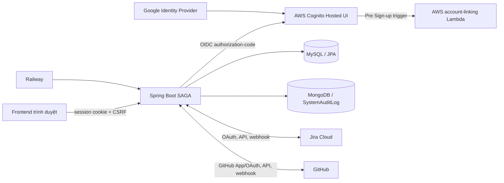
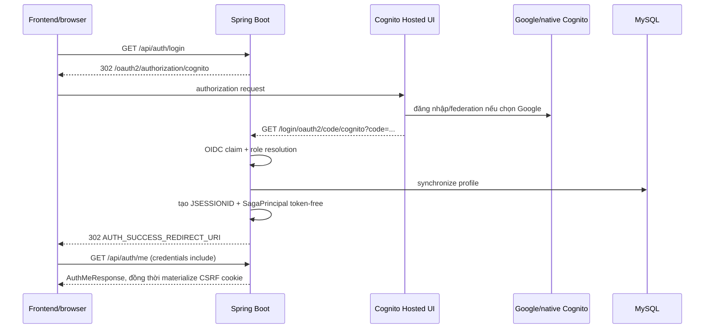

# SAGA — Context kỹ thuật hệ thống hiện tại

> Mục đích: tài liệu **as-built** cho AI assistant và developer mới. Mọi kết luận về hành vi hiện tại được phân loại: **CONFIRMED** (được source/config chứng minh), **PARTIAL** (có code nhưng chưa đầy đủ), **PLANNED** (chỉ thấy trong tài liệu), **TBD** (không xác định được từ repository), **RECOMMENDED** (đề xuất, không phải hành vi hiện tại).

## 1. Metadata của bản audit

| Mục | Giá trị |
|---|---|
| Branch | `main` |
| Commit | `52a8c71` (`chỉnh sửa lại logic student trong course và project trong một team`) |
| Thời điểm audit | 2026-08-03 (Asia/Saigon, UTC+07:00) |
| Working tree | Chỉ sáu tài liệu checkpoint đang thay đổi chưa commit; source/test hardening nằm tại HEAD `52a8c71`; không commit/push trong task này. |
| Java / Spring Boot | Java 17 / Spring Boot 4.1.0 |
| Profile tìm thấy | mặc định, `local`, `prod`, `test` |
| Phạm vi | `src/main`, `src/test`, `pom.xml`, cấu hình, Railway, Lambda Cognito, scripts và docs hiện hữu |

Evidence: `pom.xml`; `src/main/resources/application*.properties`; `railway.json`.

## 2. Tóm tắt nhanh hệ thống

**CONFIRMED.** SAGA là backend Spring Boot quản lý dữ liệu học thuật (lớp, môn, học kỳ, course), team/project và tích hợp Jira Cloud/GitHub để ingest, đồng bộ, lưu dữ liệu công việc/mã nguồn và audit. Authentication là browser session sau OIDC với Cognito; backend không trả OAuth token cho frontend. MySQL là datastore JPA chính; MongoDB chỉ lưu `SystemAuditLog`. Evidence: `SecurityConfig#securityFilterChain`, `CognitoAuthenticationSuccessHandler#replaceWithTokenFreeSessionAuthentication`, `SystemAuditLog`, `SystemAuditLogRepository`.

| Module | Trạng thái |
|---|---|
| OIDC/Cognito, profile local, session, CSRF/CORS | CONFIRMED |
| Master data Class/Course/Subject/Semester | CONFIRMED, API đơn giản |
| Team project và authorization theo team | CONFIRMED |
| Jira/GitHub OAuth, webhook, sync/backfill | CONFIRMED, có feature flag/config bắt buộc |
| Đánh giá/AI/risk/meeting/notification domain | PARTIAL: entity/repository tồn tại nhưng không có controller/service API tương ứng trong source audit |
| Import Excel sinh viên | PARTIAL: authorization course scope, transaction rollback, identity bind an toàn và invitation outbox đã có; parser/preview/error DTO/DB uniqueness vẫn chưa hoàn chỉnh |
| Frontend application | TBD: không nằm trong repository này |

## 3. Kiến trúc tổng thể



**CONFIRMED** từ `application.properties`, `SecurityConfig`, `infra/lambda/cognito-account-linking/index.mjs`, `railway.json`, các package `integration/**`. Railway dashboard, User Pool trigger wiring và Google IdP configuration là **TBD** vì không có quyền xem hạ tầng.

### Cấu trúc source code

| Package/thư mục | Trách nhiệm | Class chính | Trạng thái |
|---|---|---|---|
| `config` | security, CORS, OpenAPI, property binding, Mongo health, local seed | `SecurityConfig`, `CorsConfig`, `IntegrationPublicUrlValidator` | CONFIRMED |
| `security`, `auth`, `service` | OIDC claims, role, local profile, session/login/logout | `CognitoAuthenticationSuccessHandler`, `AuthenticatedProfileService` | CONFIRMED |
| `controller` | HTTP API | 13 REST controllers có 43 HTTP methods và 1 `@RestControllerAdvice` không endpoint | CONFIRMED |
| `entity`, `repository` | JPA/MySQL domain và Mongo audit | `Student`, `Team`, `Project`, `SystemAuditLog` | CONFIRMED |
| `integration/identity` | personal identity mapping/review | `IdentityMappingService`, `IdentityMappingReviewService` | CONFIRMED |
| `integration/project` | team project, Jira/GitHub link flow | `ProjectIntegrationService`, `TeamProjectService` | CONFIRMED |
| `integration/provider` | Jira/GitHub HTTP clients và DTO snapshot | `JiraProviderClientImpl`, `GitHubProviderClientImpl` | CONFIRMED |
| `integration/webhook`, `integration/sync` | verify, receipt, dispatch, upsert, scheduler | `WebhookIngestionService`, `AutomaticSyncDispatcherImpl` | CONFIRMED |
| `infra/lambda/cognito-account-linking` | Lambda account linking Google→native Cognito | `index.mjs` | CONFIRMED |
| `docs`, `scripts`, `infra` | runbook, migration preflight, Railway/Lambda resources | `railway.json` | PARTIAL/documentation support |

## 4. Authentication flow

**CONFIRMED.** FE bắt đầu bằng browser navigation đến `GET /api/auth/login`; controller trả `302 /oauth2/authorization/cognito`. Spring Security OAuth2 client dùng authorization-code và callback backend `/login/oauth2/code/cognito`. `CognitoAuthenticationSuccessHandler` extract OIDC claims, provision/synchronize profile, thay authentication bằng `SagaPrincipal` không có token, lưu `SecurityContext` vào HTTP session, rồi redirect `AUTH_SUCCESS_REDIRECT_URI`.



| Câu hỏi | Kết luận |
|---|---|
| Session hay Bearer | **CONFIRMED:** HTTP session (`JSESSIONID`); OpenAPI khai báo cookie API key, không phải bearer. |
| FE nhận access/ID/refresh token? | **CONFIRMED:** Không. Success handler thay authentication bằng `SagaPrincipal`; `NoStoreOAuth2AuthorizedClientRepository` không lưu authorized client. |
| `credentials: "include"`? | **CONFIRMED cho cross-origin browser fetch:** cần cookie credential; CORS bật `allowCredentials`. |
| Login redirect hay fetch? | **CONFIRMED:** redirect/browser navigation (`302`). |
| Swagger | **CONFIRMED:** schema `JSESSIONID`; mutation vẫn chịu CSRF như mọi request unsafe. |
| Callback backend vs frontend | **CONFIRMED:** OIDC callback backend là `/login/oauth2/code/cognito`; success redirect frontend lấy từ `AUTH_SUCCESS_REDIRECT_URI`. Giá trị `http://localhost:3000/auth/callback` do người dùng cung cấp là **RUNTIME FACT DO NGƯỜI DÙNG CUNG CẤP**, không phải config repo. |

Evidence: `AuthController#login`, `SecurityConfig#securityFilterChain`, `CognitoAuthenticationSuccessHandler#onAuthenticationSuccess`, `OpenApiConfig#customOpenAPI`, `NoStoreOAuth2AuthorizedClientRepository`.

### Cognito và Lambda

- **CONFIRMED:** OIDC role lấy claim Cognito groups, normalize uppercase, ưu tiên `ADMIN`, sau đó `LECTURER`, rồi `STUDENT`. Nếu claim có nhiều group, code chọn role đầu tiên theo thứ tự này. Evidence: `CognitoRoleResolver#resolve`.
- **CONFIRMED:** OIDC identity bắt buộc Cognito subject, email hợp lệ/verified, name; Student code được trích từ local-part email với regex `([A-Za-z]{2}\d{6})$`. Evidence: `OidcIdentityService#extract`, `StudentCodeExtractor#extract`.
- **CONFIRMED:** Profile local được tìm theo `cognitoSub` và email trong `Admin`, `Lecturer`, `Student`; duplicate/khác role là conflict. Student mới có `PENDING`; admin/lecturer không có `AccountStatus`. Evidence: `AuthenticatedProfileService#synchronize`, `#create`.
- **CONFIRMED:** Lambda chỉ xử lý trigger `PreSignUp_ExternalProvider`, chỉ tin `Google`, yêu cầu email verified và link Google subject vào đúng một native Cognito user cùng email; log chỉ hash email/username. Evidence: `infra/lambda/cognito-account-linking/index.mjs#createHandler`.
- **TBD:** User Pool đã gắn Lambda trigger, Google IdP đã cấu hình, priority Cognito group thực tế và cách tạo native username/password nằm ngoài repository.
- **PLANNED/PARTIAL:** README Lambda mô tả deploy/IAM nhưng không chứng minh deployment đã thực hiện.

## 5. Role và phân quyền

| Role | Loại | Quyền được code chứng minh | Phạm vi | Evidence |
|---|---|---|---|---|
| `ADMIN` | application role | Tạo master data; override team manager; review identity mapping | toàn hệ thống/team | `ClassController#createClass`, `ProjectIntegrationAuthorizationService#requireTeamManager`, `IdentityMappingReviewService#requireReviewer` |
| `LECTURER` | application role | Team/project manager nếu là instructor của `team.course` ; review mapping của student thuộc course mình dạy | course/team liên quan | `ProjectIntegrationAuthorizationService#requireTeamManager`, `IdentityMappingReviewService#requireReviewer` |
| `STUDENT` | application role | personal integration; manager team/project nếu membership `LEADER` | team của chính student | `ProjectIntegrationAuthorizationService#requireTeamManager` |
| `LEADER` | `RoleInTeam` domain role | điều kiện cho Student quản lý integration/team project | một Team | `RoleInTeam`, `TeamMember`, authorization service |
| `MEMBER` | `RoleInTeam` domain role | membership không có quyền manager riêng trong code | một Team | `RoleInTeam` |
| `MENTOR` | `RoleInTeam` domain role | enum tồn tại; chưa thấy authorization rule riêng | TBD | `RoleInTeam` |

Application role khác team role. Một Student có thể là `LEADER`; điều này **không** biến họ thành `LECTURER` hoặc `ADMIN`.

### Authorization model

- **CONFIRMED:** mọi route trừ OAuth/login/error, static GET, health, hai webhook POST (và Swagger khi flag bật) cần authenticated session. `/api/admin/**` cần `ROLE_ADMIN`. Evidence: `SecurityConfig#securityFilterChain`.
- **CONFIRMED:** method security bật: 5 `@PreAuthorize`, 0 `@Secured`. Create Class/Course/Subject/Semester là ADMIN-only; import student chặn role tổng quát ADMIN/LECTURER, sau đó service kiểm tra course scope. Evidence: controller master data, `CourseController#importStudents`, `CourseImportAuthorizationService`.
- **CONFIRMED:** team/project integration dùng service-level ownership: ADMIN, lecturer là `Course.instructor`, hoặc student là Team LEADER. Evidence: `ProjectIntegrationAuthorizationService#requireTeamManager`.
- **CONFIRMED:** identity mapping reviewer là ADMIN, hoặc LECTURER có membership/couse instructor relationship. Evidence: `IdentityMappingReviewService#requireReviewer`.
- **CONFIRMED:** CSRF áp dụng cho HTTP unsafe; chỉ `POST /api/webhooks/github` và `POST /api/webhooks/jira` bị exempt. Evidence: `SecurityConfig#securityFilterChain`.
- **CONFIRMED:** không phải toàn bộ CRUD chỉ dành cho Lecturer. Các GET master data chỉ authenticated; import Excel cho ADMIN mọi Course hoặc LECTURER là instructor của Course; STUDENT bị từ chối. Evidence: `CourseImportAuthorizationService#requireImportAccess`.
- **TBD:** account status không được SecurityConfig hay authorization services kiểm tra để chặn API; không suy ra status policy.

## 6. API endpoint matrix

Có 43 HTTP methods được khai báo trực tiếp trong 13 REST controllers. `GlobalExceptionHandler` là 1 `@RestControllerAdvice`, không khai báo endpoint. `POST /api/auth/logout` là endpoint framework-managed, không phải controller method. Mặc định `Auth` nghĩa authenticated session theo SecurityConfig. CSRF: `Có` cho POST/PUT/PATCH/DELETE, `Không áp dụng` cho GET, `Miễn` chỉ hai webhook POST.

| Method | Path | Controller#Method | Public/Auth | Role/scope | CSRF | Request → Response | Evidence |
|---|---|---|---|---|---|---|---|
| GET | `/api/auth/login` | `AuthController#login` | Public | — | Không | → 302 | controller |
| GET | `/api/auth/me` | `#me` | Auth | principal | Không | → `AuthMeResponse` | controller |
| GET | `/api/auth/csrf` | `#csrf` | Auth | principal | Không | → `CsrfTokenResponse` | controller |
| GET | `/api/v1/classes/{id}` | `ClassController#getClassById` | Auth | — | Không | → `Class` | controller |
| POST | `/api/v1/classes` | `#createClass` | Auth | ADMIN | Có | `ClassRequest` → `Class` | controller |
| GET | `/api/v1/classes` | `#getClasses` | Auth | — | Không | query → `Page<Class>` | controller |
| GET | `/api/v1/courses/{id}` | `CourseController#getCourseById` | Auth | — | Không | → `Course` | controller |
| POST | `/api/v1/courses` | `#createCourse` | Auth | ADMIN | Có | `CourseRequest` → `Course` | controller |
| GET | `/api/v1/courses` | `#getCourses` | Auth | — | Không | query → `Page<Course>` | controller |
| GET | `/api/v1/courses/instructors` | `#getLecturersForCourseAssignment` | Auth | ADMIN; anonymous 401, LECTURER/STUDENT 403 | Không | keyword chỉ fullName/email; `sortBy` fullName/email; `sortDirection` asc/desc; invalid query 400; page/size → `Page<LecturerOptionResponse>` | controller/service |
| GET | `/api/v1/courses/{courseId}/students` | `#getCourseStudents` | Auth | ADMIN mọi Course; LECTURER phải là instructor; anonymous 401, STUDENT/lecturer ngoài scope 403, Course thiếu 404 | Không | keyword; `hasTeam` all/with/without; sortBy studentCode/fullName/email/teamName/projectName; sortDirection asc/desc; invalid query 400; page/size → `CourseStudentRosterResponse` | controller/service |
| POST | `/api/v1/courses/{courseId}/import-students` | `#importStudents` | Auth | ADMIN mọi Course; LECTURER phải là instructor; STUDENT bị chặn | Có | multipart `file` → String | controller + `CourseImportAuthorizationService` |
| GET | `/api/v1/courses/{courseId}/teams/{teamId}/members` | `TeamRosterController#getMembers` | Auth | ADMIN mọi Team; Lecturer chỉ Course mình dạy; Student phải thuộc đúng Team, LEADER và MEMBER đều được | Không | page/size → `Page<TeamMemberResponse>` (không email/cognitoSub/version) | controller + `TeamRosterService` |
| GET | `/api/v1/subjects/{id}` | `SubjectController#getSubjectById` | Auth | — | Không | → `Subject` | controller |
| POST | `/api/v1/subjects` | `#createSubject` | Auth | ADMIN | Có | `SubjectRequest` → `Subject` | controller |
| GET | `/api/v1/subjects` | `#getSubjects` | Auth | — | Không | query → `Page<Subject>` | controller |
| GET | `/api/v1/semesters/{id}` | `SemesterController#getSemesterById` | Auth | — | Không | → `Semester` | controller |
| POST | `/api/v1/semesters` | `#createSemester` | Auth | ADMIN | Có | `SemesterRequest` → `Semester` | controller |
| GET | `/api/v1/semesters` | `#getSemesters` | Auth | — | Không | query → `Page<Semester>` | controller |
| POST | `/api/teams/{teamId}/projects` | `TeamProjectController#create` | Auth | team manager | Có | `CreateTeamProjectRequest` → `ProjectResponse` | `TeamProjectController#create`; `TeamProjectService#create` |
| GET | `/api/integrations/identity-mappings` | `IdentityMappingReviewController#mappings` | Auth | reviewer scope | Không | `studentId` → list | controller/service |
| PATCH | `/api/integrations/identity-mappings/{mappingId}` | `#review` | Auth | reviewer scope | Có | review DTO → connection | controller/service |
| GET | `/api/me/integrations` | `PersonalIntegrationController#connections` | Auth | own principal | Không | → connections | controller |
| GET | `/api/me/integrations/jira/connect` | `#connectJira` | Auth | own principal | Không | → 302 | controller |
| DELETE | `/api/me/integrations/jira` | `#disconnectJira` | Auth | own principal | Có | → 204 | controller |
| GET | `/api/me/integrations/github/connect` | `#connectGitHub` | Auth | own principal | Không | → 302 | controller |
| GET | `/api/me/integrations/github/callback` | `#githubCallback` | Auth | session/state | Không | → connection | controller |
| DELETE | `/api/me/integrations/github` | `#disconnectGitHub` | Auth | own principal | Có | → 204 | controller |
| GET | `/api/integrations/jira/callback` | `JiraIntegrationCallbackController#callback` | Auth | session/state | Không | → object | controller |
| GET | `/api/projects/{projectId}/integrations` | `ProjectIntegrationController#integrations` | Auth | team manager | Không | → status | controller/service |
| GET | `/api/projects/{projectId}/jira/connect` | `#jiraConnect` | Auth | team manager | Không | → 302 | controller/service |
| POST | `/api/projects/{projectId}/jira/link` | `#jiraLink` | Auth | team manager/session grant | Có | Jira DTO → status | controller/service |
| DELETE | `/api/projects/{projectId}/jira` | `#jiraDisconnect` | Auth | team manager | Có | → 204 | controller/service |
| GET | `/api/projects/{projectId}/github/install` | `#githubInstall` | Auth | team manager | Không | → 302 | controller/service |
| GET | `/api/projects/{projectId}/github/setup` | `#githubSetup` | Auth | session/state | Không | → 302 | controller/service |
| GET | `/api/projects/{projectId}/github/callback` | `#githubCallback` | Auth | session/state | Không | → installation | controller/service |
| POST | `/api/projects/{projectId}/github/repositories` | `#githubRepositories` | Auth | team manager/installation owner | Có | GitHub DTO → status | controller/service |
| DELETE | `/api/projects/{projectId}/github/repositories/{repositoryId}` | `#githubRepositoryDisconnect` | Auth | team manager | Có | → 204 | controller/service |
| GET | `/api/projects/{projectId}/sync-status` | `#syncStatus` | Auth | team manager | Không | → sync status | controller/service |
| GET | `/api/integrations/github/setup` | `ProjectIntegrationCallbackController#githubSetup` | Auth | session/state | Không | → 302 | controller |
| GET | `/api/integrations/github/project/callback` | `#githubCallback` | Auth | session/state | Không | → installation | controller |
| POST | `/api/webhooks/github` | `WebhookController#github` | Public | signature verification | Miễn | raw bytes → 200/202 | controller/service |
| POST | `/api/webhooks/jira` | `#jira` | Public | token/JWT authentication | Miễn | raw bytes → 202 | controller/service |
| GET | `/oauth2/authorization/cognito` | Spring OAuth2 authorization request filter | Public | OIDC initiation | Không | → 302 Cognito | `SecurityConfig#securityFilterChain` |
| GET | `/login/oauth2/code/cognito` | Spring OAuth2 login filter | Public | state/code validation | Không | provider callback → session/redirect | OAuth registration + `SecurityConfig` |
| POST | `/api/auth/logout` | Spring Security logout filter | Auth | own session | Có | → Cognito logout 302 | `SecurityConfig#securityFilterChain`; `CognitoLogoutSuccessHandler` |
| GET | `/actuator/health` | Spring Boot Actuator | Public | — | Không | → health JSON | `application.properties`; `SecurityConfig` |
| GET | `/v3/api-docs/**` | Springdoc | Public khi flag bật | — | Không | → OpenAPI JSON | `SecurityConfig`; `OpenApiConfig` |
| GET | `/swagger-ui/**`, `/swagger-ui.html` | Springdoc | Public khi flag bật | — | Không | → Swagger UI/assets | `SecurityConfig`; `OpenApiConfig` |

Static GET `/`, `/index.html`, `/favicon.ico`, `/assets/**`, `/css/**`, `/js/**`, `/images/**` cũng public theo `SecurityConfig`; đây là resource mappings, không tính vào 43 controller methods. Swagger/OpenAPI public chỉ khi corresponding enable flag bật.

### Frontend integration contract

**CONFIRMED:** dùng browser navigation cho login/authorization redirect, `fetch`/Axios có `credentials: "include"` cho API, không dùng `Authorization: Bearer`, không đọc/lưu OAuth JWT/token trong localStorage. Sau login gọi `/api/auth/me`, lấy CSRF qua cookie hoặc `GET /api/auth/csrf`; mutation gửi `X-XSRF-TOKEN`. Swagger UI cùng origin dùng global interceptor để bootstrap/read cookie và chỉ gắn header cho unsafe method. 401/403 trả JSON error, frontend phải xử lý theo status. Logout gọi `POST /api/auth/logout` có CSRF và browser nhận redirect Cognito. Evidence: `AuthController`, `SecurityConfig`, `SwaggerUiCsrfConfiguration`, `CognitoLogoutSuccessHandler`, `docs/FRONTEND_API_INTEGRATION.md`.

**RUNTIME FACT DO NGƯỜI DÙNG CUNG CẤP:** frontend dev `http://localhost:3000`; production backend `https://saga-backend-production-3951.up.railway.app`; FE success route dự kiến `/auth/callback`; OIDC callback vẫn backend. Các giá trị chỉ hoạt động nếu environment `FRONTEND_ORIGINS`, `AUTH_SUCCESS_REDIRECT_URI`, cookie settings triển khai tương ứng.

## 7. CORS, cookie và CSRF

- **CONFIRMED:** origin lấy từ `app.cors.allowed-origins=${FRONTEND_ORIGINS}`, cấm wildcard/path/query; methods GET/POST/PUT/PATCH/DELETE/OPTIONS; headers `Authorization`, `Content-Type`, `X-XSRF-TOKEN`, `Accept`; expose `Location`; `allowCredentials=true`; preflight cache 3600s. Evidence: `CorsConfig#corsConfigurationSource`.
- **CONFIRMED:** CSRF cookie repository là `CookieCsrfTokenRepository.withHttpOnlyFalse()`, path `/`, cookie name mặc định `XSRF-TOKEN`; request handler mặc định đọc `X-XSRF-TOKEN`; webhook exempt. Evidence: `SecurityConfig#csrfTokenRepository`, `#securityFilterChain`.
- **CONFIRMED:** `JSESSIONID` HttpOnly do servlet session cookie; CSRF cookie deliberately không HttpOnly. Local sets `secure=false`, `same-site=lax`; prod defaults `SESSION_COOKIE_SECURE=true`, `SESSION_COOKIE_SAME_SITE=none`. Evidence: `application-local.properties`, `application-prod.properties`.
- **CONFIRMED:** `/api/auth/csrf` tồn tại và trả token/header/parameter, không trả session/OAuth secret. Evidence: `AuthController#csrf`, `CsrfTokenResponse`.
- **RỦI RO / PARTIAL:** localhost HTTP → Railway HTTPS là cross-origin và thường là cross-site (schemeful same-site); browser có thể chặn third-party cookie dù SameSite=None; Secure. `document.cookie` ở FE origin **không thể** đọc cookie domain Railway. FE có thể gọi `/api/auth/csrf` với credentials để nhận token JSON; mutation cross-origin vẫn phụ thuộc browser cho phép credential cookie. Đây là constraint trình duyệt, không phải code chứng minh production đang hoạt động.
- **RECOMMENDED:** kiểm thử bằng browser production-like và cân nhắc cùng-site custom domain/BFF nếu third-party cookies bị chặn.

## 8. Configuration và environment variables

Không tìm thấy `application.yml`/`application-*.yml`; project dùng `application.properties`, `application-local.properties`, `application-prod.properties` và `application-test.properties`. Không ghi giá trị secret. Các property dưới đây lấy từ các file này và `.env.example`.

| Property | Environment variable | Profile/default | Secret | Mục đích |
|---|---|---|---|---|
| `server.port` | `PORT` | `8080` | Không | HTTP port |
| `app.public-base-url` | `PUBLIC_BASE_URL` | local có `http://localhost:8080` | Không | public backend origin |
| `app.cors.allowed-origins` | `FRONTEND_ORIGINS` | bắt buộc | Không | explicit CORS origins |
| auth success/logout/domain | `AUTH_SUCCESS_REDIRECT_URI`, `AUTH_LOGOUT_REDIRECT_URI`, `COGNITO_DOMAIN` | logout fallback success | domain không secret | redirect/logout |
| OIDC issuer/client | `COGNITO_ISSUER_URI`, `COGNITO_CLIENT_ID`, `COGNITO_CLIENT_SECRET` | bắt buộc | client secret | Cognito client |
| session cookie secure/same-site | `SESSION_COOKIE_SECURE`, `SESSION_COOKIE_SAME_SITE`; Spring relaxed names `SERVER_SERVLET_SESSION_COOKIE_SECURE`, `SERVER_SERVLET_SESSION_COOKIE_SAME_SITE` cũng map property | local false/lax; prod true/none | Không | session/CSRF cross-site |
| MySQL | `DATABASE_JDBC_URL`, `DATABASE_USERNAME`, `DATABASE_PASSWORD`; legacy `AIVEN_*` | — | password | JPA datasource |
| Flyway | `FLYWAY_ENABLED`, `FLYWAY_BASELINE_ON_MIGRATE` | false | Không | schema migration |
| Mongo | `MONGO_URI`, `MONGO_DATABASE`, `MONGO_HEALTH_TIMEOUT` | timeout PT5S | URI | Mongo audit |
| Swagger | `SPRINGDOC_API_DOCS_ENABLED`, `SPRINGDOC_SWAGGER_UI_ENABLED`, legacy `SWAGGER_ENABLED` | local true; default false | Không | OpenAPI UI |
| Jira | `JIRA_*` và `JIRA_INTEGRATION_ENABLED`, `JIRA_TIME_ZONE` | enabled true base; local false | client secret | Jira OAuth/webhook |
| GitHub | `GITHUB_*`, `GITHUB_INTEGRATION_ENABLED` | enabled true base; local false | secret/private key/webhook secret | GitHub App/OAuth/webhook |
| encryption | `INTEGRATION_TOKEN_ENCRYPTION_KEY`, `_KEY_ID`, `_PREVIOUS_KEYS` | key id `primary` | keys | encrypt integration credentials |
| scheduler/network | `INTEGRATION_*`, `SYNC_JOB_STALE_AFTER`, `STALE_SYNC_JOB_RECOVERY_DELAY_MS` | defined defaults | Không | sync/reconciliation |
| local seed | `LOCAL_DEMO_SEED_ENABLED`, `LOCAL_DEMO_LEADER_COGNITO_SUB` | disabled | subject identifier | local demo only |

## 9. Database và domain model

**CONFIRMED:** 40 JPA entities use MySQL; `SystemAuditLog` is one Mongo document. Hibernate validates (`ddl-auto=validate`) outside tests; Flyway migrations V2–V7 are committed, baseline V1 is intentionally external/legacy. No generic soft-delete field/annotation found. Evidence: `application.properties`, `src/main/resources/db/migration/*`, entities.

```mermaid
erDiagram
    CLASS ||--o{ COURSE : clazz
    COURSE ||--o{ TEAM : course
    TEAM ||--o{ TEAM_MEMBER : team
    STUDENT ||--o{ TEAM_MEMBER : student
    TEAM ||--o| PROJECT : project
    PROJECT ||--o| JIRA_BOARD : board
    PROJECT ||--o{ GIT_REPO : repositories
    STUDENT ||--o{ IDENTITY_MAP : identities
    PROJECT ||--o{ SYNC_JOB_LOG : jobs
    GIT_REPO ||--o{ COMMIT_DATA : commits
    GIT_REPO ||--o{ GIT_ISSUE : issues
```

| Nhóm | Datastore/repository | Quan hệ hoặc unique đáng chú ý | Trạng thái |
|---|---|---|---|
| `Admin`, `Lecturer`, `Student` | MySQL / repo tương ứng | Student unique `cognitoSub`, `studentCode`, `email`; status ACTIVE/INACTIVE/SUSPENDED/PENDING | CONFIRMED |
| Class/Subject/Semester/Course | MySQL | Course→Class/Subject/Semester/Lecturer | CONFIRMED |
| Team/TeamMember/Project | MySQL | Team→Course; Team→Project one-to-one unique; member has domain `RoleInTeam`. Product rule: Student tối đa một Team mỗi Course; application guard có, DB invariant trực tiếp chưa có | CONFIRMED/PARTIAL |
| Jira/GitHub integration | MySQL | `JiraBoard`, `GitHubInstallation`, `GitRepo`, migration unique external IDs | CONFIRMED |
| external data | MySQL | task/sprint/issue/PR/review/commit/comment, upsert/dedup constraints migration | CONFIRMED |
| audit | Mongo / `SystemAuditLogRepository` | collection `system_audit_log` | CONFIRMED |
| assessment/risk/meeting/document/AI | MySQL entities | relationships exist in annotations; no full HTTP use-case proven | PARTIAL |

Transactions are declared on service methods, notably profile sync, team/project/integration/sync and `ExcelImportService#importStudentsToCourse`. Cascade behavior is entity-specific; no global rule should be assumed. `IntegrationSecretCipher` handles encrypted provider credentials; do not log/decrypt values.

## 10. Jira integration

**CONFIRMED:** project and personal Jira use OAuth state bound to HTTP session; callback exchanges code, stores encrypted credential/board state, then project linking may register dynamic webhook and trigger sync. Webhook ingestion validates Jira token/JWT, persists receipt then dispatcher processes/upserts with cursor/overlap window, job log and reconciliation/stale-job scheduler. Availability flag returns safe `INTEGRATION_NOT_CONFIGURED` when disabled.

Key classes: `PersonalIntegrationService`, `JiraOAuthCallbackService`, `ProjectIntegrationService#beginJira/#linkJira`, `JiraProviderClientImpl`, `JiraCredentialService`, `WebhookIngestionService`, `JiraWebhookAuthenticator`, `AutomaticSyncDispatcherImpl`, `JiraSyncJobService`, `JiraWebhookMaintenanceService`.

## 11. GitHub integration

**CONFIRMED:** GitHub App/OAuth routes support personal connect and project installation/setup/callback, then repository link. `ProjectIntegrationAuthorizationService` and installation-owner checks constrain project flow; webhook HMAC signature is verified before receipt processing. Initial backfill/reconciliation dispatch GitHub snapshots into deduplicating upsert services; installation token uses App private key but value is never documented here.

Key classes: `ProjectIntegrationService#beginGitHubInstallation/#linkGitHubRepositories`, `GitHubProviderClientImpl`, `GitHubWebhookSignatureVerifier`, `GitHubInitialBackfillJobService`, `GitHubDataUpsertService`, `WebhookReceiptProcessor`.

## 12. Deployment

**CONFIRMED từ repository:** Railway uses Railpack, builds `mvn clean package -DskipTests`, starts jar, health checks `/actuator/health`, restarts on failure up to 10. `server.port` honors `PORT`; forwarded headers strategy is `framework`. Local profile enables Swagger and disables integrations; prod defaults Secure+SameSite=None. Evidence: `railway.json`, application profiles.

**TBD:** Railway variables, actual active profile, database connectivity, session persistence across redeploy/horizontal replicas, deployed Lambda and real production URL/dashboard. HTTP session is in-memory by default in the shown code; absent shared session store, loss after restart and non-sticky multi-replica risk is **RECOMMENDED to verify**, not a confirmed deployment fact.

### Error handling

| Status | Trường hợp | Format/evidence |
|---|---|---|
| 400 | invalid integration input/callback/config request | `IntegrationException.invalid`, `GlobalExceptionHandler` |
| 401 | unauthenticated | `JsonAuthenticationEntryPoint`, `UnauthenticatedRequestException` |
| 403 | authorization hoặc CSRF | `JsonAccessDeniedHandler`; CSRF filter |
| 404 | master data not found | services throw `ResponseStatusException` |
| 409 | identity conflict/project duplication | `IdentityConflictException`, `IntegrationException.conflict` |
| 422 | invalid OIDC identity | `InvalidIdentityException` |
| 500 | uncaught runtime/validation/import paths | Spring default; no uniform custom handler proven |
| 502/503 | provider failure/not configured | `IdentityServiceException`, `IntegrationException` |

`ApiErrorResponse` fields: timestamp/status/error/message/path. Integration errors use stable `error` code; framework validation and `ResponseStatusException` body are not normalized by this advice. Stack trace hiding is configured in `application.properties`.

### Test hiện có

Có 56 test source classes. **CONFIRMED:** full `./mvnw.cmd test` trong working tree (chỉ khác HEAD ở Markdown) pass 54 suites / 249 tests / 0 failures / 0 errors / 0 skipped. `CourseRosterAndLecturerOptionsIntegrationTest` bao phủ authorization, filter/sort/pagination, invalid query, email exposure và legacy invalid data nhiều Team không crash. `CourseTeamMembershipGuardIntegrationTest` bao phủ idempotency, conflict 409, role độc lập khác Course và hai transaction cạnh tranh. Provisioning/invitation tests bao phủ reuse imported Student, conflict, membership/role preservation, competitive bind, outbox dedup/template/failure/retry, concurrent claim và stale recovery. `SecurityIntegrationTest` xác nhận logout framework-managed trả 302 với CSRF hợp lệ (kể cả anonymous) và 403 khi CSRF thiếu/sai. `CsrfMutationMethodIntegrationTest`, `CourseImportSecurityIntegrationTest` và `SwaggerUiCsrfIntegrationTest` xác nhận header/cookie thực tế, multipart và generated Swagger initializer. Maven dùng Java runtime 21.0.7 trên máy audit, trong khi project compile target Java 17.

Evidence: `src/test/java/**`, `infra/lambda/cognito-account-linking/test/index.test.mjs`.

## 13. Known issues

| Severity | Vấn đề | Evidence | Khuyến nghị |
|---|---|---|---|
| Medium | Import tạo Student `PENDING` không có Cognito sub cho tới lần login đầu; binding contract đã có nhưng deployed Cognito self-sign-up vẫn TBD | `ExcelImportService#importStudentsToCourse`, `AuthenticatedProfileService#synchronize` | E2E với Cognito deployment thật |
| High | Import chỉ check tên `.xlsx`, sheet đầu tiên, magic indexes; không header/email/group/leader/duplicate validation | `ExcelImportService` | không deploy như import production |
| Medium | Membership guard ở application level theo Student+Course; chưa có database invariant trực tiếp `UNIQUE(student_id, course_id)` | `ExcelImportService`, `StudentRepository#findForTeamMembershipWriteById`, `TeamMemberRepository#findByStudentIdAndTeamCourseId` | RECOMMENDED: thiết kế migration/invariant DB sau khi có kế hoạch xử lý legacy data |
| Medium | API master-data trả JPA entities trực tiếp | Class/Course/Subject/Semester controllers | tạo response DTO ổn định trước FE lớn |
| Medium | Error format không thống nhất cho validation/ResponseStatusException/uncaught runtime | `GlobalExceptionHandler` | thêm error advice chung |
| Medium | Cross-site cookie/CSRF giữa localhost và Railway phụ thuộc browser third-party cookie policy | CORS/security/prod profile | E2E browser test và chiến lược same-site |
| Low | Swagger interceptor chỉ đọc được cookie backend khi Swagger UI cùng origin API; browser E2E cross-site frontend vẫn phải kiểm chứng riêng | `SwaggerUiCsrfConfiguration`, `AuthController#csrf` | dùng `/api/auth/csrf` cho FE khác origin và chạy browser E2E |
| Low | `AccountStatus` có thể null cho Admin/Lecturer và `AuthMeResponse` có null | profile service/DTO | xác định UI contract, không render string `"null"` |

### Việc cần làm tiếp theo

### Bắt buộc trước khi FE tích hợp

1. Hoàn thiện import Excel: preview, validation/error DTO và production email provider. Permission ADMIN/lecturer scope, auth/CSRF/rollback/idempotency/identity-binding và membership concurrency guard đã có test.
2. Chốt FE cookie topology và test browser cross-origin. Rủi ro: login/API mutation không giữ session. Xác minh: `me`, `csrf`, POST từ origin FE thật.
3. Chuẩn hóa error contract cho validation/404/runtime. Rủi ro: FE không parse được lỗi. Xác minh: contract tests.

### Bắt buộc trước production

1. Set và validate toàn bộ secret/environment trên Railway, không commit `.env`; `IntegrationPublicUrlValidator`. Xác minh: startup safe and health.
2. Xác minh session persistence/scaling/redeploy. Rủi ro: logout ngẫu nhiên. Xác minh: rolling restart/multiple instances.
3. Run full Maven + Lambda test suites; Railway currently builds with `-DskipTests`.

### Nên cải thiện sau

1. DTO cho master data; 2. API/authorization coverage tests; 3. expose only intentional operational endpoints; 4. document/develop assessment domain APIs when implemented.

### Runbook kiểm tra nhanh

1. Local: copy `.env.example` to untracked `.env`, populate placeholders without sharing secrets; select `local` profile; run `./mvnw spring-boot:run` (Windows: `./mvnw.cmd`).
2. Health: `GET /actuator/health` is public. Swagger only when its flags are enabled.
3. Login: navigate browser to `/api/auth/login`, finish Cognito, then call `/api/auth/me` with credentials.
4. CSRF: call `GET /api/auth/csrf`; send returned token in `X-XSRF-TOKEN` plus session cookie for unsafe API.
5. Role checks: exercise ADMIN create master data; lecturer/student/team-leader project integration negative and positive cases using seeded/controlled data.
6. Jira/GitHub: only enable configured provider in a non-production test tenant; verify connect callback, webhook signature/auth and sync status.
7. CORS/cookie: inspect browser Network/Application, not just curl; verify preflight, JSESSIONID, XSRF token and a mutation.
8. Railway: inspect dashboard logs/health/environment separately; it is outside this repository.

## 14. Context tóm tắt cho AI

```text
PROJECT: SAGA Spring Boot backend.
CURRENT ARCHITECTURE: Spring MVC + Spring Security/OIDC + MySQL JPA + Mongo audit + Jira/GitHub integrations.
AUTH MODEL: Cognito OIDC authorization-code; browser JSESSIONID; SagaPrincipal replaces token-bearing auth.
ROLES: ADMIN, LECTURER, STUDENT; team roles LEADER/MEMBER/MENTOR.
FRONTEND ORIGIN: Configured by FRONTEND_ORIGINS; localhost value is user runtime fact.
BACKEND ORIGIN: Configured by PUBLIC_BASE_URL; Railway URL is user runtime fact.
LOGIN ENTRY: GET /api/auth/login (302).
OIDC CALLBACK: /login/oauth2/code/cognito.
CURRENT USER ENDPOINT: GET /api/auth/me.
SESSION: HTTP session; no bearer/OAuth token returned to FE.
CSRF: XSRF-TOKEN cookie / X-XSRF-TOKEN header; /api/auth/csrf exists; webhooks exempt.
DATABASES: MySQL for JPA; MongoDB system_audit_log only.
INTEGRATIONS: Jira OAuth/webhook/sync; GitHub App/OAuth/webhook/backfill.
DEPLOYMENT: Railway config exists; runtime dashboard/state TBD.
KNOWN ISSUES: Excel import identity/validation contract is incomplete; cookie cross-site risk; inconsistent error DTOs.
CURRENT NEXT STEP: Complete import validation/provider delivery and browser E2E CORS/CSRF/session testing.
```

## Update 2026-08-02 — Imported Student provisioning and invitation outbox

- **CONFIRMED:** Import normalizes email (trim/lowercase) and student code (trim/uppercase). Existing data is reused only when both values identify the same Student; a partial or split match is a 409 conflict.
- **CONFIRMED:** A STUDENT login first looks up `cognitoSub`. If absent, verified Cognito email plus the existing `StudentCodeExtractor` result must both identify one unlinked Student. The bind uses a transaction and pessimistic row lock; it writes only `cognitoSub` and changes `PENDING` to `ACTIVE`. It never creates/replaces TeamMember, Team, Course, email or student code.
- **CONFIRMED:** `ACTIVE` remains active; `INACTIVE` and `SUSPENDED` are not auto-activated. Admin/Lecturer provisioning retains its former path.
- **CONFIRMED:** Import creates a deduplicated `student_course_invitation` outbox record after a TeamMember exists. V6 stores the outbox unique key; V7 supplies the Student optimistic-lock version/backfill required before Hibernate validate. AFTER_COMMIT processing records `SENT` or `FAILED`, retries pending/failed work up to five attempts, and only reclaims stale `PROCESSING` claims after configurable timeout. Delivery failure never rolls back import; delivery semantics are at-least-once.
- **PARTIAL:** The default adapter deliberately reports delivery unavailable. No production email provider/dependency/configuration exists in this repository, so production delivery is **TBD**.
- **TBD:** Spreadsheet header/schema validation, preview, row-level error DTO, a database unique constraint for `team_member(team_id, student_id)`, and deployed Cognito self-sign-up configuration.
- **CONFIRMED:** Login URL is configuration-driven by `STUDENT_INVITATION_LOGIN_URL` through `app.student-invitation.login-url`; no localhost/Railway URL or callback route is hard-coded.
- **CONFIRMED:** Logout is Spring Security framework-managed: `POST /api/auth/logout` needs `X-XSRF-TOKEN`, returns 302 to Cognito with valid CSRF and 403 otherwise. Swagger fetch can show `Failed to fetch` for the cross-origin Cognito redirect; browser clients use top-level form/navigation.
- **CONFIRMED:** Team roster is paged and never serializes Student email, Cognito subject or version. Its 401/403/404 contract is covered by integration tests.
- **Runtime fact (user-provided):** a Railway deployment failed because `student.version` was absent. V6/V7 must run before Hibernate validate; no production migration log is in this repository, therefore production migration state remains TBD.
- **Verification:** full `./mvnw.cmd test` on the current working tree passed 54 suites / 249 tests / 0 failures / 0 errors / 0 skipped.
DO NOT ASSUME: FE implementation, infrastructure wiring, deployment variables, User Pool trigger setup, session scaling, or unimplemented assessment APIs.

## Update 2026-08-03 — Course roster, lecturer options và one-Team-per-Course guard

- **CONFIRMED tại HEAD `52a8c71`:** `GET /api/v1/courses/{courseId}/students` cho ADMIN mọi Course và LECTURER là instructor; anonymous 401, STUDENT/lecturer ngoài scope 403, Course không có 404. GET không cần CSRF. `hasTeam` chỉ nhận `all|with|without`; roster whitelist `studentCode|fullName|email|teamName|projectName`, direction `asc|desc`; invalid query 400. Filter/sort chạy trước pagination, metadata tính trên toàn bộ tập sau filter và tie-break ổn định theo id.
- **PARTIAL:** roster materialize từ `TeamMember -> Team -> Course`; invitation outbox không phải enrollment source. Không có quan hệ Student–Course độc lập cho Student chưa có Team nên `studentsWithoutTeam`/`hasTeam=without` hiện rỗng, không phải feature đầy đủ. Legacy invalid data nhiều Team cùng Course chỉ được đọc không crash, không phải business behavior hợp lệ.
- **CONFIRMED tại HEAD `52a8c71`:** lecturer options là ADMIN-only (anonymous 401; LECTURER/STUDENT 403), keyword chỉ `fullName`/`email`, không tìm/trả `cognitoSub`; whitelist sort `fullName|email`, direction `asc|desc`, invalid query 400 và GET không cần CSRF.
- **ACCEPTED bởi Product Owner:** Student có thể thuộc nhiều Course nhưng tối đa một Team trong mỗi Course; `RoleInTeam` và Project độc lập theo Team/Course. Nhiều Team/Project trong một Course hợp lệ nếu mỗi Project thuộc Team khác; không hợp lệ khi cùng Student ở hai Team khác nhau trong cùng Course.
- **CONFIRMED tại HEAD `52a8c71`:** `ExcelImportService` là production write path duy nhất tạo TeamMember. Service lock Student bằng `PESSIMISTIC_WRITE`, rồi query Student+Course: chưa có membership thì tạo; cùng Team thì idempotent, không đổi role; Team khác cùng Course là 409, không move/delete/update membership cũ; Course khác hợp lệ. Local seed không tạo dữ liệu trái rule.
- **PARTIAL:** concurrency guard application đã được kiểm thử bằng hai thread và hai transaction độc lập; database chưa có invariant trực tiếp `UNIQUE(student_id, course_id)`, nên chỉ bảo vệ các write path tuân thủ guard. Email Student trong roster và email Lecturer trong options hiện được trả cho actor đã được authorize, nhưng business/UI justification cho hai field vẫn **TBD**; response không chứa `cognitoSub`, version, token hay credential.

### Traceability index

| Chủ đề | File/class chính | Method/điểm đọc |
|---|---|---|
| URL authorization/CSRF/session | `SecurityConfig` | `securityFilterChain`, `csrfTokenRepository` |
| CORS | `CorsConfig` | `corsConfigurationSource` |
| OIDC success/profile | `CognitoAuthenticationSuccessHandler`, `AuthenticatedProfileService` | `onAuthenticationSuccess`, `synchronize` |
| Role priority | `CognitoRoleResolver` | `resolve` |
| Team authorization | `ProjectIntegrationAuthorizationService` | `requireTeamManager` |
| Identity review | `IdentityMappingReviewService` | `requireReviewer` |
| HTTP API | `src/main/java/com/saga/be/controller/*` | mappings listed in section 9 |
| Jira/GitHub | `integration/project`, `provider`, `webhook`, `sync` | methods cited sections 14–15 |
| Lambda link | `infra/lambda/cognito-account-linking/index.mjs` | `createHandler` |
| deployment/config | `application*.properties`, `railway.json`, `.env.example` | property tables |

Không có password, credential, token, private key, encryption key, webhook secret, session cookie hoặc CSRF token thực tế trong tài liệu này.
