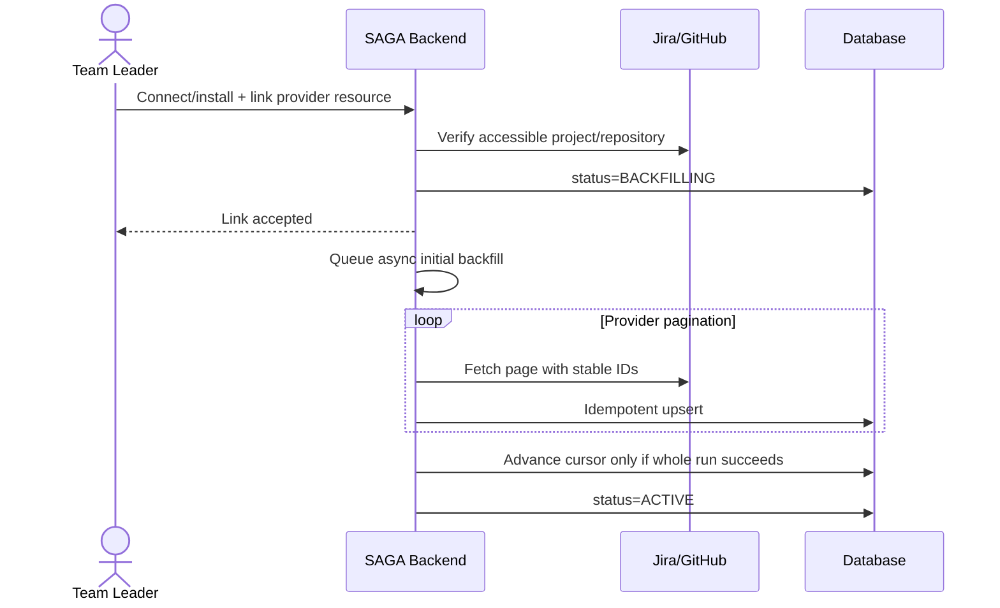
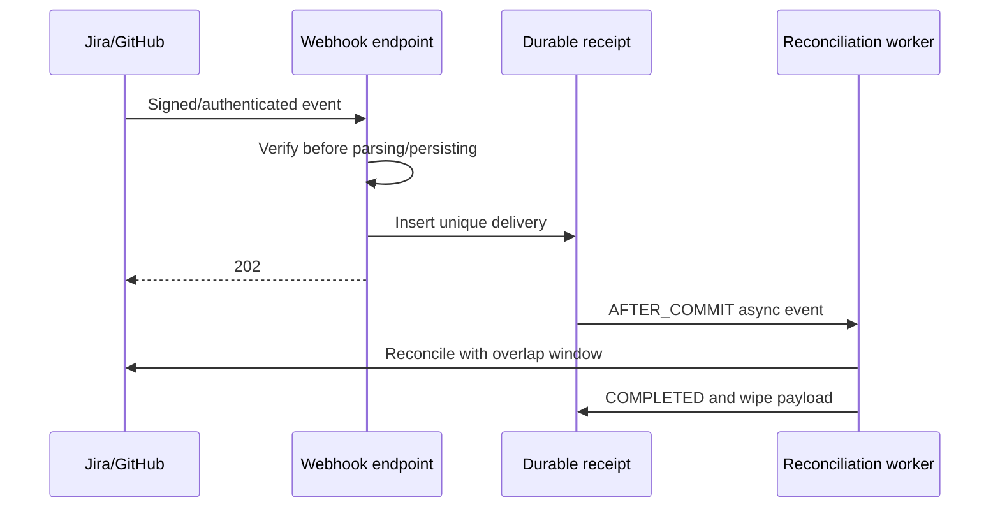

# SAGA Jira/GitHub integrations

## 1. Kiến trúc và ranh giới tin cậy

Module có hai khái niệm độc lập:

| Phạm vi | Mục đích | Chủ thể quản lý | Credential |
|---|---|---|---|
| Personal identity | Xác minh Student nào tương ứng với actor Jira/GitHub nào | Chính Student đó; ADMIN/LECTURER chỉ review/correct theo quyền | Token user ngắn hạn, bỏ ngay sau xác minh |
| Project integration | Đồng bộ Jira project và GitHub repositories vào SAGA Project | Team Leader của đúng team, ADMIN, hoặc Lecturer phụ trách course | Jira refresh/access token mã hóa; GitHub App installation token cache trong RAM |

Không dùng Jira personal token để sync project. Không dùng GitHub user token
thay cho installation token. Không ánh xạ bằng email commit, login/username từ
request body, hoặc account ID do client tự nhập.

`IdentityMap` lưu Atlassian `accountId` hoặc GitHub numeric user ID làm khóa ổn
định. Display name, login và email chỉ là metadata có thể thay đổi. Mỗi
Student/provider và mỗi provider/external ID đều có unique constraint. Khi
disconnect, row và `IdentityMappingHistory` vẫn còn; activity lịch sử không bị
xóa hoặc tự động chuyển sang Student khác.

## 2. API

### Personal identity

```text
GET    /api/me/integrations
GET    /api/me/integrations/jira/connect
DELETE /api/me/integrations/jira
GET    /api/me/integrations/github/connect
GET    /api/me/integrations/github/callback
DELETE /api/me/integrations/github
```

Tất cả endpoint trên yêu cầu Spring session đã đăng nhập và role `STUDENT`.
Không endpoint nào nhận `studentId`, Jira `accountId`, GitHub user ID hay
username từ client. OAuth `state` có 256 bit ngẫu nhiên, chỉ lưu hash trong
session, gắn với Cognito subject, local profile ID, flow, target project, TTL,
và chỉ dùng một lần. Collision định danh trả `409`.

Review workflow:

```text
GET  /api/integrations/identity-mappings
POST /api/integrations/identity-mappings/{mappingId}/review
```

ADMIN review toàn hệ thống. Lecturer chỉ review mapping của Student thuộc team
trong course mình phụ trách. Các action approve/reject/correct đều ghi history
và audit.

### Team project và project integration

```text
POST   /api/teams/{teamId}/projects
GET    /api/projects/{projectId}/integrations
GET    /api/projects/{projectId}/jira/connect
POST   /api/projects/{projectId}/jira/link
DELETE /api/projects/{projectId}/jira
GET    /api/projects/{projectId}/github/install
GET    /api/projects/{projectId}/github/setup
GET    /api/projects/{projectId}/github/callback
POST   /api/projects/{projectId}/github/repositories
DELETE /api/projects/{projectId}/github/repositories/{repositoryId}
GET    /api/projects/{projectId}/sync-status
```

Các route có `{projectId}` được giữ cho API client. Provider console phải dùng
callback cố định sau để không phụ thuộc UUID động:

```text
GET /api/integrations/jira/callback
GET /api/integrations/github/setup
GET /api/integrations/github/project/callback
```

Jira personal identity và project integration dùng chung callback cố định. Backend
không nhận `flow`, `studentId` hoặc `projectId` từ query string để phân luồng;
`OAuthStateService` consume state một lần rồi lấy flow và target project đã bind
trong Spring session phía server.

Chỉ `TeamMember.roleInTeam=LEADER` của đúng team được quản lý. `ADMIN` được
review/repair toàn hệ thống; `LECTURER` chỉ được làm vậy với course do mình phụ
trách. Member thường và leader của team khác nhận `403`. Mỗi lần ADMIN dùng
override đều ghi `PROJECT_INTEGRATION_ADMIN_OVERRIDE`; thao tác fail-closed nếu
audit store không ghi được.

GitHub Setup URL không được tin trực tiếp. Sau khi GitHub trả
`installation_id`, backend tự mở GitHub user authorization, dùng token user
ngắn hạn gọi danh sách installations mà user truy cập được, kiểm tra đúng ID,
rồi bỏ token. Chỉ sau bước đó installation mới được ghi. Sync repository luôn
dùng installation token.

### Webhook

```text
POST /api/webhooks/jira
POST /api/webhooks/github
```

Đây là hai route public duy nhất của module và cũng là hai route duy nhất được
CSRF-ignore. GitHub phải có `X-Hub-Signature-256` hợp lệ trên raw body và được
so sánh constant-time. Jira dynamic webhook bắt buộc có `Authorization: Bearer
<JWT>`; backend chỉ chấp nhận `HS256`, xác minh chữ ký bằng
`JIRA_CLIENT_SECRET`, kiểm tra `exp` và các time claim nếu có. Jira không dùng
logic GitHub HMAC trên raw body. Secret 256 bit riêng trong query string chỉ là
khóa định tuyến/phòng thủ phụ theo connection; database chỉ lưu SHA-256 hash.
Reverse proxy, APM và access log phải redact Authorization header và toàn bộ
query string của Jira webhook.

Receipt được persist trước khi xử lý, payload được AES-256-GCM encrypt,
`(provider, deliveryId)` là unique, và duplicate trả `202 DUPLICATE`. Worker
retry tối đa năm lần; receipt `PROCESSING` không đổi trong năm phút được coi là
worker đã chết và được đưa lại vào hàng retry. Vì receipt nằm trong MySQL và
event async chỉ phát `AFTER_COMMIT`, restart không làm mất event. Payload được
xóa sau khi xử lý thành công. Log/audit chỉ ghi error category an toàn, không
ghi token, secret hoặc raw payload.

## 3. Luồng tự động

Không có manual sync endpoint.





Status lifecycle:

```text
CONNECTING -> BACKFILLING -> ACTIVE
                        \-> DEGRADED -> ACTIVE
                                      \-> DISCONNECTED
```

Scheduler chạy reconciliation cho `ACTIVE/DEGRADED`, dùng overlap window mặc
định 5 phút. Event cũ hơn `externalUpdatedAt` bị bỏ qua. Một item lỗi làm job
`PARTIAL_FAILURE`, connection thành `DEGRADED`, và cursor không tiến để lần sau
không mất dữ liệu. Jira webhook được refresh trước hạn; dynamic webhook Jira
hết hạn sau 30 ngày theo tài liệu Atlassian.

## 4. Cấu hình Atlassian OAuth 2.0 3LO

Trong Atlassian Developer Console:

1. Tạo OAuth 2.0 integration.
2. Đăng ký chính xác một callback:
   - `${PUBLIC_BASE_URL}/api/integrations/jira/callback`
3. Cấp classic scopes tối thiểu hiện dùng:
   `read:me read:jira-user read:jira-work offline_access manage:jira-webhook`.
   Không cấp `write:jira-work`.
4. Đặt `JIRA_WEBHOOK_PUBLIC_URL` là HTTPS public URL
   `${PUBLIC_BASE_URL}/api/webhooks/jira`.

Backend đăng ký issue, comment và sprint events tự động khi link project.
Atlassian lưu ý JQL filter không giới hạn sprint events; handler vì vậy không
tin payload để chọn project mà dùng secret connection, sau đó reconciliation
resource đã link. Với non-public OAuth app, người đăng ký webhook phải phù hợp
app owner theo giới hạn của Atlassian; kiểm tra rule này trước production.

Nguồn chính thức:

- [Jira dynamic webhook REST API](https://developer.atlassian.com/cloud/jira/platform/rest/v3/api-group-webhooks/)
- [Jira webhook events and sprint limitations](https://developer.atlassian.com/cloud/jira/platform/webhooks/)
- [Atlassian HTTPS webhook deprecation](https://developer.atlassian.com/cloud/jira/platform/deprecation-notice-registering-webhooks-with-non-secure-urls/)

## 5. Cấu hình GitHub App

Trong GitHub App settings:

1. Callback URLs:
   - `${PUBLIC_BASE_URL}/api/me/integrations/github/callback`
   - `${PUBLIC_BASE_URL}/api/integrations/github/project/callback`
2. Setup URL:
   `${PUBLIC_BASE_URL}/api/integrations/github/setup`.
3. Webhook URL: `${PUBLIC_BASE_URL}/api/webhooks/github`; bật Active và đặt
   cùng secret với `GITHUB_WEBHOOK_SECRET`.
4. Repository permissions:
   - Metadata: Read-only
   - Contents: Read-only
   - Issues: Read-only
   - Pull requests: Read-only
5. Subscribe events:
   `installation`, `installation_repositories`, `push`, `issues`,
   `issue_comment`, `pull_request`, `pull_request_review`,
   `pull_request_review_comment`.

Không tạo webhook riêng cho từng repository. GitHub App webhook được cấu hình
một lần và GitHub gửi installation/repository context trong payload. Private
key phải là PKCS#8 PEM; installation token chỉ cache trong RAM tới gần expiry,
không persist.

GitHub cảnh báo `installation_id` ở Setup URL có thể bị spoof; flow xác minh
user-access-token của module xử lý đúng rủi ro này. Chữ ký webhook dùng HMAC
SHA-256 và raw request body.

Nguồn chính thức:

- [GitHub Setup URL security warning](https://docs.github.com/en/apps/creating-github-apps/registering-a-github-app/about-the-setup-url)
- [Installations accessible to a user token](https://docs.github.com/en/rest/apps/installations)
- [Validate webhook deliveries](https://docs.github.com/en/webhooks/using-webhooks/validating-webhook-deliveries)
- [Configure GitHub App permissions/events](https://docs.github.com/en/apps/maintaining-github-apps/modifying-a-github-app-registration)

## 6. Environment variables

Xem `.env.example`. Bắt buộc ở production:

```text
INTEGRATION_TOKEN_ENCRYPTION_KEY
INTEGRATION_TOKEN_ENCRYPTION_KEY_ID
INTEGRATION_TOKEN_ENCRYPTION_PREVIOUS_KEYS
JIRA_CLIENT_ID
JIRA_CLIENT_SECRET
JIRA_CALLBACK_URL
JIRA_WEBHOOK_PUBLIC_URL
GITHUB_APP_ID
GITHUB_CLIENT_ID
GITHUB_CLIENT_SECRET
GITHUB_PRIVATE_KEY
GITHUB_WEBHOOK_SECRET
GITHUB_APP_SLUG
GITHUB_SETUP_URL
GITHUB_PERSONAL_CALLBACK_URL
GITHUB_PROJECT_CALLBACK_URL
GITHUB_WEBHOOK_PUBLIC_URL
```

Tạo encryption key:

```powershell
[Convert]::ToBase64String(
  [System.Security.Cryptography.RandomNumberGenerator]::GetBytes(32)
)
```

Ciphertext mới có dạng `v2.<key-id>.<ciphertext>`, dùng nonce GCM 96 bit ngẫu
nhiên mới cho mỗi lần encrypt. Khi rotate: chuyển key đang dùng vào
`INTEGRATION_TOKEN_ENCRYPTION_PREVIOUS_KEYS` theo dạng
`old-id:BASE64,older-id:BASE64`, đặt active key/key ID mới, deploy, rồi
re-encrypt dữ liệu theo runbook kiểm soát trước khi loại key cũ. Key chỉ được
lấy từ protected runtime configuration/secret manager, không commit vào repo.
Secret không được trả trong API response, audit hoặc log.

## 7. Migration preflight

`V1` được dành riêng để biểu diễn baseline của schema legacy.
`V2__integration_identity_and_sync.sql` là migration integration đầu tiên.
Flyway mặc định tắt trong application runtime (`FLYWAY_ENABLED=false`) và
`baselineOnMigrate=false`; task này tuyệt đối không chạy migration lên live DB.

### Schema non-empty và chưa có `flyway_schema_history`

1. Backup và thử restore backup.
2. Deploy code ở maintenance window; dừng writer cũ.
3. Chạy file chỉ đọc
   `docs/integrations/mysql-integration-preflight.sql` bằng DB user read-only.
   Tất cả duplicate/orphan check phải trả 0 row; ba bảng integration mới và
   các cột V2 phải chưa tồn tại.
4. Sửa dữ liệu legacy theo quyết định nghiệp vụ và lưu audit; không tự đoán
   external stable ID từ username.
5. Chỉ trong một deployment job được phê duyệt, bật:

   ```text
   FLYWAY_ENABLED=true
   FLYWAY_BASELINE_ON_MIGRATE=true
   spring.flyway.baseline-version=1
   ```

   Baseline version phải là `1`, không phải `0`. Flyway tạo baseline row V1 rồi
   áp dụng V2. Không bật cấu hình này đồng thời trên nhiều application instance.
6. Ngay sau job, trả `FLYWAY_ENABLED=false` và
   `FLYWAY_BASELINE_ON_MIGRATE=false`.
7. Chạy ứng dụng với `ddl-auto=validate`; xác nhận migration thành công trước
   khi mở traffic.

### Schema đã có `flyway_schema_history`

Không bật `baselineOnMigrate`. Kiểm tra toàn bộ history và preflight. Chỉ migrate
V2 khi không có successful V2 và không có DDL integration một phần. Nếu bản cũ
đã ghi migration integration dưới version `1`, dừng deployment: không chạy V2
vì sẽ lặp DDL; DBA phải đối chiếu checksum/schema và lập kế hoạch
repair/baseline riêng được review.

### Trạng thái chính xác sau khi V2 thành công

`flyway_schema_history` phải có hai successful row theo thứ tự:

| installed_rank | version | description | type | script | checksum | success |
|---:|---:|---|---|---|---|---:|
| 1 | 1 | `<< Flyway Baseline >>` | `BASELINE` | `<< Flyway Baseline >>` | `NULL` | 1 |
| 2 | 2 | `integration identity and sync` | `SQL` | `V2__integration_identity_and_sync.sql` | non-null | 1 |

`installed_by` là DB principal của deployment job; `installed_on` và
`execution_time` do Flyway ghi. Không được có failed row. Ba bảng mới phải tồn
tại: `identity_mapping_history`, `github_installation`, `webhook_receipt`.
Các bảng legacy được V2 alter là `identity_map`, `project`, `jira_board`,
`git_repo`, `task`, `sprint`, `git_issue`, `commit_data`, `pull_request`,
`pr_review`, `comment`, `sync_job_log`. Entity `IdentityMap` vẫn dùng bảng
legacy `identity_map`; không tạo bảng hoạt động lịch sử mới ngoài các bảng trên.

Rollback schema phải dùng restore backup hoặc migration forward đã review.
Không drop các bảng history/activity khi disconnect integration.

## 8. Local verification và runbook

Local:

```powershell
Copy-Item .env.example .env
.\mvnw.cmd clean test
.\mvnw.cmd clean package -DskipTests
```

OAuth/webhook thật cần HTTPS tunnel và phải cập nhật callback/webhook URL ở cả
provider console lẫn `.env`. Không log URL query đầy đủ.

Khi connection `DEGRADED`:

1. Xem `/api/projects/{projectId}/sync-status` và `sync_job_log.error_message`
   (chỉ chứa category).
2. Jira: kiểm tra refresh-token grant, scopes, app owner rule, webhook expiry,
   site/project access.
3. GitHub: kiểm tra installation chưa suspended/deleted, repository vẫn nằm
   trong installation, permissions/events chưa chờ owner approve.
4. Sửa quyền/provider state; scheduler sẽ tự reconciliation và trả `ACTIVE`.
5. Không chỉnh cursor tiến lên bằng tay. Nếu buộc sửa, phải có incident ticket,
   snapshot DB và audit.

Nếu webhook backlog tăng, giữ endpoint trả nhanh sau durable insert, scale
worker, và kiểm tra receipt `FAILED` có đạt retry cap. Không replay bằng cách
đổi delivery ID; hãy reset receipt có kiểm soát hoặc chạy reconciliation.

## 9. Business rules cần chốt trước khi mở rộng

- Personal mapping hiện ACTIVE ngay sau provider verification; review workflow
  dùng cho ngoại lệ/correction. Nếu tổ chức muốn approval bắt buộc, đổi trạng
  thái sau connect sang `PENDING_REVIEW` và không attribution cho tới approval.
- Jira custom field story point/sprint ID đang dùng default phổ biến
  `customfield_10016`/`customfield_10020`; site có field ID khác cần cấu hình
  per connection thay vì hard-code thêm.
- Retention của encrypted failed webhook payload và mapping history cần được
  legal/security phê duyệt; successful payload đã bị wipe.
